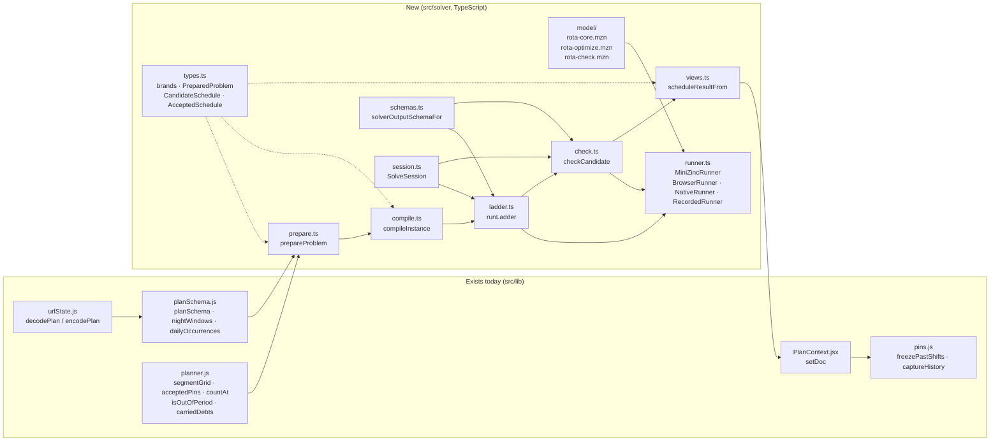
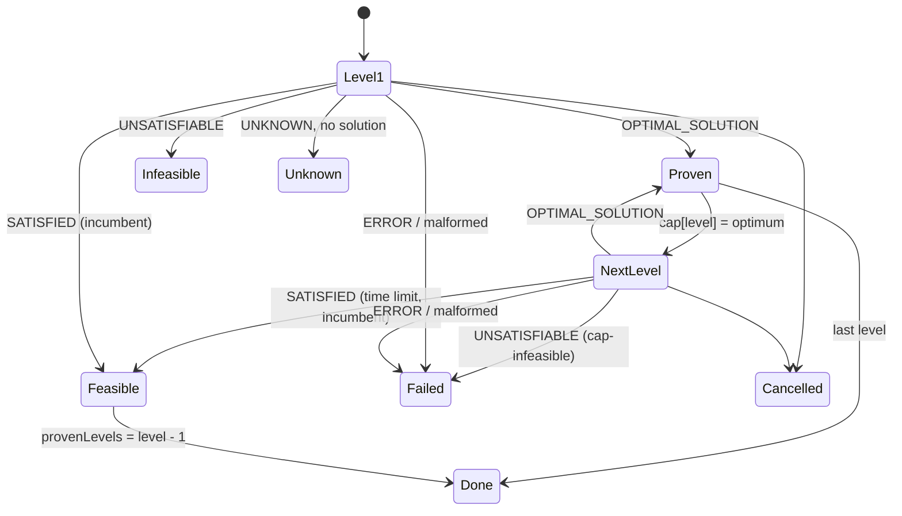
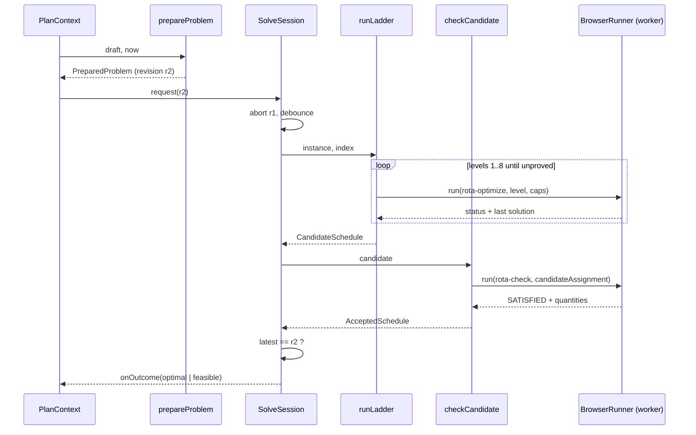
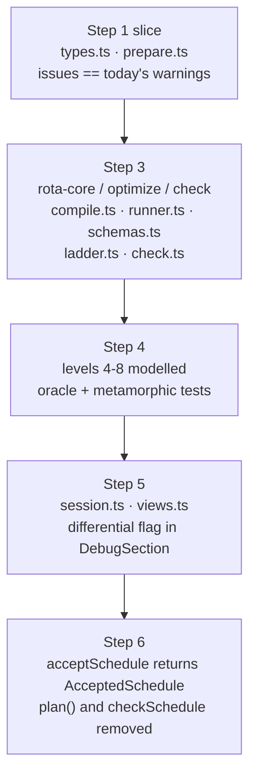

# MiniZinc implementation design for ADR 017

- Status: **Design only, nothing implemented.** Resolves ADR 017's decision to
  the class and function level for the MiniZinc path: migration steps 3 to 6,
  plus the slice of step 1 the solver needs. History as its own domain value
  (step 2) is named where the solver touches it and otherwise left to its own
  design.
- Date: 2026-09-16
- Reads with: ADR 011 (the model and its measurements), ADR 017 (the
  boundaries), `prototype/minizinc/README.md` (what has been measured).

Every name below is a proposal for a symbol that does not exist yet. Where a
function already exists and is reused, its current file is named so nothing
here is mistaken for a second implementation of it.

## What is being built



The engine in `planner.js` stays the production authority until step 6. The
new modules run beside it behind a flag first (step 5), then replace
`acceptSchedule`'s call into it.

## 1. Types (`src/solver/types.ts`)

Branded scalars, each with a Zod constructor in `schemas.ts`:

| Brand             | Underlying | Constructed by                 |
|-------------------|------------|--------------------------------|
| `EmployeeId`      | string     | `employeeIdSchema`             |
| `MissionId`       | string     | `missionIdSchema`              |
| `QualificationId` | string     | `qualificationIdSchema`        |
| `InstantMs`       | number     | `instantSchema` (finite int)   |
| `DurationMinutes` | number     | `durationMinutesSchema` (≥ 0)  |
| `SegmentIndex`    | number     | `segmentIndexSchema` (1-based) |
| `ProblemRevision` | string     | `revisionOf` (see §9)          |

Domain values, as `readonly` interfaces:

```ts
interface PreparedEmployee {
  id: EmployeeId;
  available: Interval;                 // clamped to the horizon
  qualifications: ReadonlySet<QualificationId>;
  carriedDutyMinutes: DurationMinutes; // already normalized and clamped
  carriedStints: number;
  requiredNightRestMinutes: DurationMinutes; // 0 when nothing applies
}

type PreparedMission =
  | { kind: 'local'; id: MissionId; window: Interval; daySeats: number; nightSeats: number;
      slotBounds: readonly InstantMs[]; requires: readonly Requirement[];
      exclusions: Exclusions; onCall: boolean }
  | { kind: 'remote'; id: MissionId; window: Interval; seats: number;
      requires: readonly Requirement[]; exclusions: Exclusions; onCall: boolean }
  | { kind: 'daily'; id: MissionId; occurrences: readonly Interval[]; seats: number;
      requires: readonly Requirement[]; exclusions: Exclusions; onCall: boolean };

interface Commitment {               // a manual pin or a logged record, resolved
  employeeId: EmployeeId;
  missionId: MissionId;
  coverage: Interval;                // literal instants, never null
  provenance: 'manual' | 'logged';
}

interface PreparedProblem {
  horizon: Interval;
  loggedBefore: InstantMs;
  nights: readonly Interval[];       // viewer-timezone, resolved
  employees: readonly PreparedEmployee[];
  missions: readonly PreparedMission[];
  commitments: readonly Commitment[];
  fairness: 'minutes' | 'turns';     // strategy, see open decision A
  issues: readonly PreparationIssue[];
  revision: ProblemRevision;
}
```

Solver-side values:

```ts
interface SolverInstance { /* the JSON handed to MiniZinc, §3 */ }

interface InstanceIndex {            // how to read the answer back
  segments: readonly Interval[];     // global grid, 1-based on the model side
  employeeIds: readonly EmployeeId[];
  missionIds: readonly MissionId[];
  slotOfSegment: number[][];         // [missionIndex][segmentIndex]
  holdOfSegment: number[][];
}

interface CandidateSchedule {
  revision: ProblemRevision;
  assignment: Uint8Array;            // employeeCount × segmentCount, 0 = off duty
  claimed: NamedQuantities;          // what optimize mode reported
  provenLevels: number;              // 0..LEVEL_COUNT
}

interface AcceptedSchedule {
  revision: ProblemRevision;
  assignment: Uint8Array;            // identical to the candidate's
  quantities: NamedQuantities;       // what CHECK mode recomputed
  diagnostics: SegmentDiagnostics;   // per-cell outputs of check mode, §4.6
  proof: 'optimal' | 'feasible';
  provenLevels: number;
}

type SolveOutcome =
  | { kind: 'optimal';    accepted: AcceptedSchedule }
  | { kind: 'feasible';   accepted: AcceptedSchedule }
  | { kind: 'infeasible'; revision: ProblemRevision; level: 1 }
  | { kind: 'unknown';    revision: ProblemRevision; level: number }
  | { kind: 'cancelled';  revision: ProblemRevision }
  | { kind: 'failed';     revision: ProblemRevision; reason: FailureReason; detail: string };

type FailureReason = 'model-error' | 'worker' | 'malformed-output'
  | 'dimension-mismatch' | 'objective-mismatch' | 'cap-infeasible' | 'stale-revision';
```

`assignment` is a flat `Uint8Array` indexed `employee * segmentCount + segment`,
0-based on this side. One byte per cell is the representation ADR 017 asks for:
a cell holds one mission index or zero, so two missions in one cell cannot be
written. `missionCount` is bounded to 255 by `schemas.ts`; a document with more
missions than that is a preparation issue, not a runtime surprise.

`freezePastShifts` and every history function accept `AcceptedSchedule` and
nothing wider. `CandidateSchedule` has no method that yields rows.

## 2. Preparation (`src/solver/prepare.ts`)

```ts
function prepareProblem(draft: DraftPlan, clock: { now: InstantMs }): PreparedProblem
```

`DraftPlan` is what `planSchema.parse` returns today; the strict draft schema is
step 1's concern and does not gate this module. `prepareProblem` never throws
on a half-typed document. It reuses the existing rules rather than restating
them, so each helper below is a thin function over an export that already
exists:

| Helper                         | Reuses                                                 | Adds                                                                                                |
|--------------------------------|--------------------------------------------------------|-----------------------------------------------------------------------------------------------------|
| `resolveNights(draft)`         | `nightWindows` (planSchema.js)                         | nothing                                                                                             |
| `resolveOccurrences(draft,m)`  | `dailyOccurrences` (planSchema.js)                     | issue `daily-missing-clock` when a bound is null                                                    |
| `resolveEmployees(draft)`      | `normalizeEmployees` via `segmentGrid`'s `prepare`     | `requiredNightRestMinutes` from `tags[].minNightRestMinutes`                                        |
| `resolveMissions(draft)`       | `normalizeMissions`, `slotBoundsFor` via `segmentGrid` | the discriminated union; issues `mission-outside-window`, `tag-required-and-excluded`               |
| `resolveCommitments(draft)`    | `acceptedPins` (planner.js)                            | provenance; issues `pin-conflict`, `pin-overflow`, `pin-unavailable`, `pin-availability-overridden` |
| `resolveCarriedDuty(draft)`    | `carriedDebts` (planner.js, to be exported)            | nothing                                                                                             |
| `countStaleCommitments(draft)` | `isOutOfPeriod`, `isElapsedBeforePeriod`               | issue `pin-out-of-period` with `count` and `elapsed`                                                |

`PreparationIssue` is a discriminated union keyed on `code`, with the same
codes and fields the engine's warnings carry today, so `findings.js` renders
them unchanged.

Two rules are the solver's and live here rather than in the model:

- **Elapsed, recorded segments keep their own headcount** (ADR 009). For a
  local segment ending before `loggedBefore` that at least one commitment
  covers, `seatsWanted` is the number of committed people, not today's count.
  Nothing is demanded there and nothing can be evicted. An elapsed segment with
  no record is prepared like any other.
- **A remote commitment is the whole mission**, whatever range was written.
  `acceptedPins` already widens it; preparation keeps that.

`prepareProblem` is pure. `now` enters here as `loggedBefore`, exactly as it
enters `toPlannerInput` today, and nowhere else in `src/solver`.

## 3. Compilation (`src/solver/compile.ts`)

```ts
function compileInstance(problem: PreparedProblem): { instance: SolverInstance; index: InstanceIndex }
```

The successor of `prototype/minizinc/fromPlan.mjs::toInstance`, split into
functions that can be tested one at a time:

```ts
function buildGlobalSegmentGrid(problem): { segments: Interval[]; edges: InstantMs[] }
// Union of every mission's own edges: local missions contribute segmentGrid's
// segments, remote and daily missions contribute window edges only, employees
// contribute availability edges, nights contribute their edges. Sorted, deduped.

function seatsWantedMatrix(problem, segments): number[][]
// countAt(mission, segment.start, nights), 0 outside the mission's windows,
// the recorded headcount on an elapsed recorded segment (§2).

function slotAndHoldMatrices(problem, segments): { slotOfSegment: number[][]; holdOfSegment: number[][] }
// Local: the slot id from the mission's own grid (never recomputed).
// Remote: one hold id for the mission. Daily: one hold id per occurrence.
// Ids are unique across missions, so a slot and a hold can never collide.

function availabilityMatrix(problem, segments): boolean[][]
function allowedMatrix(problem): boolean[][]

function commitmentTriples(problem, index): { pinEmployee: number[]; pinMission: number[]; pinSegment: number[] }
// One triple per (commitment, covered segment). Two triples naming the same
// cell with different missions are NOT merged: the model reports infeasible.

function requirementTables(problem, index): { requirementMission: number[]; requirementSeats: number[]; holdsRequirement: boolean[][] }

function nightOfSegment(problem, segments): number[]
// 0 for a day segment, else the 1-based index of the night it lies in.

function enumerateLongRunWindows(segments, capMinutes = MAX_UNBROKEN_MINUTES): { first: number[]; last: number[] }
// Every minimal window of consecutive segments whose minutes exceed the cap:
// for each first segment, the smallest last segment past the cap. Linear in
// segmentCount. MAX_UNBROKEN_MINUTES is imported from strategies.js so ADR 016's
// number has one definition.

function deriveSymmetryClasses(instance): number[]
// Same rule as prototype/minizinc/solve.mjs::symClasses, on the new arrays:
// identical availability row, allowed row, qualification column, carried
// minutes and rest requirement, and no commitment anywhere. 0 = singleton.

function instanceToJsonData(instance, ladder: LadderParams): object
// The object handed to Model.addJson. Nested arrays for 2-D parameters;
// 0..0 arrays are emitted as [] for empty pin and requirement lists.
```

`SolverInstance` is exactly the parameter list of `rota-core.mzn` in §4.1,
with the same names, so a reader can hold the two side by side.

Time is a segment index on the model side and `segmentMinutes` carries every
duration. Nothing epoch-sized crosses the boundary.

## 4. The model (`src/solver/model/`)

Three files. `rota-core.mzn` declares parameters, the decision, the hard rules
and every named quantity. The two entry files each `include` it and add only a
`solve` item and, for check mode, the fixing constraint.

### 4.1 `rota-core.mzn`

```minizinc
% Guard rota: one assignment matrix over the global segment grid (ADR 017).
% Time is a segment index; every duration is `segmentMinutes`.

include "lex_lesseq.mzn";

int: MODEL_VERSION = 1;
int: LEVEL_COUNT = 8;
int: OFF_DUTY = 0;

% ---- sizes ----------------------------------------------------------------
int: employeeCount;
int: missionCount;
int: segmentCount;
int: nightCount;
int: pinCount;
int: requirementCount;
int: longRunWindowCount;

set of int: Employees      = 1..employeeCount;
set of int: Missions       = 1..missionCount;
set of int: MissionOrOff   = 0..missionCount;
set of int: Segments       = 1..segmentCount;
set of int: Nights         = 1..nightCount;
set of int: Pins           = 1..pinCount;
set of int: Requirements   = 1..requirementCount;
set of int: LongRunWindows = 1..longRunWindowCount;
set of int: Levels         = 1..LEVEL_COUNT;

% ---- the grid -------------------------------------------------------------
array[Segments] of int: segmentMinutes;
array[Segments] of int: nightOfSegment;          % 0 = day
array[Missions, Segments] of int: seatsWanted;   % 0 = not running
array[Missions, Segments] of int: slotOfSegment; % rotation slot, 0 = none
array[Missions, Segments] of int: holdOfSegment; % indivisible hold, 0 = none

% ---- people ---------------------------------------------------------------
array[Employees, Segments] of bool: isAvailable;
array[Employees, Missions] of bool: isAllowed;   % not excluded by tag or name
array[Employees] of int: carriedDutyMinutes;     % normalized, clamped (ADR 015)
array[Employees] of int: carriedStints;
array[Employees] of int: requiredNightRestMinutes; % 0 = no requirement
array[Employees] of int: symmetryClass;          % 0 = nobody else is like me

% ---- missions -------------------------------------------------------------
array[MissionOrOff] of bool: isSleepable;        % index OFF_DUTY is true

% ---- commitments: manual pins and logged duty, one row per covered cell ---
array[Pins] of Employees: pinEmployee;
array[Pins] of Missions:  pinMission;
array[Pins] of Segments:  pinSegment;

% ---- qualification requirements -------------------------------------------
array[Requirements] of Missions: requirementMission;
array[Requirements] of int: requirementSeats;
array[Requirements, Employees] of bool: holdsRequirement;

% ---- windows longer than the unbroken-run cap (ADR 016) -------------------
array[LongRunWindows] of Segments: longRunFirstSegment;
array[LongRunWindows] of Segments: longRunLastSegment;

% ---- the ladder (optimize mode reads these; check mode ignores them) ------
int: objectiveLevel;
array[Levels] of int: objectiveCap;              % -1 = uncapped
int: fairnessMode;                               % 0 = minutes, 1 = turns

% ---- the decision ---------------------------------------------------------
% One cell, one mission. Double booking is not a value this array can hold.
array[Employees, Segments] of var MissionOrOff: assignedMission :: output;

% ---- derived views of the decision ---------------------------------------
array[Employees, Missions, Segments] of var bool: isOnMission =
  array3d(Employees, Missions, Segments, [
    assignedMission[employee, segment] == mission
    | employee in Employees, mission in Missions, segment in Segments ]);

array[Employees, Segments] of var bool: isOnDuty =
  array2d(Employees, Segments, [
    assignedMission[employee, segment] != OFF_DUTY
    | employee in Employees, segment in Segments ]);

array[Employees, Segments] of bool: isPinnedCell =
  array2d(Employees, Segments, [
    exists(pin in Pins)(pinEmployee[pin] == employee /\ pinSegment[pin] == segment)
    | employee in Employees, segment in Segments ]);

array[Missions, Segments] of var 0..employeeCount: seatsFilled :: output =
  array2d(Missions, Segments, [
    sum(employee in Employees)(isOnMission[employee, mission, segment])
    | mission in Missions, segment in Segments ]);

% ---- hard rules -----------------------------------------------------------
% A commitment is a fact. Two commitments on one cell make the instance
% infeasible rather than one of them disappearing.
constraint forall(pin in Pins)(
  assignedMission[pinEmployee[pin], pinSegment[pin]] == pinMission[pin]);

% Availability and exclusions bind every cell a person did not commit by hand.
constraint forall(employee in Employees, segment in Segments
    where not isAvailable[employee, segment] /\ not isPinnedCell[employee, segment])(
  assignedMission[employee, segment] == OFF_DUTY);

constraint forall(employee in Employees, mission in Missions, segment in Segments
    where not isAllowed[employee, mission] /\ not isPinnedCell[employee, segment])(
  assignedMission[employee, segment] != mission);

% Nobody stands a mission that is not running.
constraint forall(employee in Employees, mission in Missions, segment in Segments
    where seatsWanted[mission, segment] == 0)(
  assignedMission[employee, segment] != mission);

% A mission never holds more people than it wants.
constraint forall(mission in Missions, segment in Segments)(
  seatsFilled[mission, segment] <= seatsWanted[mission, segment]);

% Crew inside a hold cannot change: a remote mission end to end, a daily
% occurrence whole.
constraint forall(employee in Employees, mission in Missions, segment in 2..segmentCount
    where holdOfSegment[mission, segment] > 0
       /\ holdOfSegment[mission, segment] == holdOfSegment[mission, segment - 1])(
  isOnMission[employee, mission, segment] == isOnMission[employee, mission, segment - 1]);

% Interchangeable people are ordered, so the solver does not walk their
% permutations. Prunes nothing real: members of a class can be swapped without
% changing any quantity below.
constraint forall(employee in 1..employeeCount - 1
    where symmetryClass[employee] > 0
       /\ symmetryClass[employee] == symmetryClass[employee + 1])(
  lex_lesseq([assignedMission[employee + 1, segment] | segment in Segments],
             [assignedMission[employee,     segment] | segment in Segments]));

% ---- named quantities -----------------------------------------------------
% Every floor is declared. MiniZinc does not fold the headcount rule into the
% inferred bounds of a `seatsWanted - seatsFilled` sum, and an unbounded
% objective turns a millisecond optimum into minutes of failed proof.

int: horizonMinutes = sum(segment in Segments)(segmentMinutes[segment]);
int: totalSeatMinutes = sum(mission in Missions, segment in Segments)(
  seatsWanted[mission, segment] * segmentMinutes[segment]);
int: totalRequirementMinutes = sum(requirement in Requirements, segment in Segments
    where seatsWanted[requirementMission[requirement], segment] > 0)(
  requirementSeats[requirement] * segmentMinutes[segment]);
int: totalNightMinutes = sum(segment in Segments where nightOfSegment[segment] > 0)(
  segmentMinutes[segment]);

% Level 1: required qualifications not covered, in seat-minutes.
array[Requirements, Segments] of var 0..employeeCount: qualifiedSeatsFilled :: output =
  array2d(Requirements, Segments, [
    sum(employee in Employees where holdsRequirement[requirement, employee])(
      isOnMission[employee, requirementMission[requirement], segment])
    | requirement in Requirements, segment in Segments ]);

var 0..totalRequirementMinutes: unmetQualificationMinutes :: output =
  sum(requirement in Requirements, segment in Segments
      where seatsWanted[requirementMission[requirement], segment] > 0)(
    max(0, requirementSeats[requirement] - qualifiedSeatsFilled[requirement, segment])
      * segmentMinutes[segment]);

% Level 2: seats left empty, in seat-minutes.
var 0..totalSeatMinutes: unfilledSeatMinutes :: output =
  sum(mission in Missions, segment in Segments)(
    (seatsWanted[mission, segment] - seatsFilled[mission, segment]) * segmentMinutes[segment]);

% Level 3: crew changing hands between two segments of one rotation slot.
% Soft, because a commitment covering half a slot must be able to hand over at
% its own edge. Above rest on purpose: a rest preference must never create a
% shift boundary (AGENTS.md).
var 0..employeeCount * missionCount * segmentCount: slotHandoverCount :: output =
  sum(employee in Employees, mission in Missions, segment in 2..segmentCount
      where seatsWanted[mission, segment] > 0
         /\ seatsWanted[mission, segment - 1] > 0
         /\ slotOfSegment[mission, segment] == slotOfSegment[mission, segment - 1])(
    isOnMission[employee, mission, segment] != isOnMission[employee, mission, segment - 1]);

% Rest is measured inside the night and inside the person's own availability,
% exactly as rest.js measures it. On-call duty is slept through (ADR 007).
array[Employees, Segments] of var bool: isAwakeOnDuty =
  array2d(Employees, Segments, [
    not isSleepable[assignedMission[employee, segment]]
    | employee in Employees, segment in Segments ]);

array[Employees, Nights] of var 0..totalNightMinutes: nightRestMinutes :: output =
  array2d(Employees, Nights, [
    sum(segment in Segments
        where nightOfSegment[segment] == night /\ isAvailable[employee, segment])(
      segmentMinutes[segment] * (1 - isAwakeOnDuty[employee, segment]))
    | employee in Employees, night in Nights ]);

% Level 4: shortfall against the configured per-qualification minimum.
var 0..employeeCount * nightCount * totalNightMinutes: restShortfallMinutes :: output =
  sum(employee in Employees, night in Nights where requiredNightRestMinutes[employee] > 0)(
    max(0, requiredNightRestMinutes[employee] - nightRestMinutes[employee, night]));

% Level 5: shortfall against the eight-hour total preference, for the same
% people. The continuous six-hour preference is a reported metric (§10) until
% a level of its own is modelled.
int: PREFERRED_TOTAL_REST_MINUTES = 480;
var 0..employeeCount * nightCount * PREFERRED_TOTAL_REST_MINUTES: preferredRestShortfallMinutes :: output =
  sum(employee in Employees, night in Nights where requiredNightRestMinutes[employee] > 0)(
    max(0, max(requiredNightRestMinutes[employee], PREFERRED_TOTAL_REST_MINUTES)
             - nightRestMinutes[employee, night]));

% Level 6: unbroken runs past the cap (ADR 016). One per (person, window)
% fully on duty. Soft, so a roster with nobody spare still gets an answer.
array[Employees] of var 0..longRunWindowCount: longRunsByEmployee :: output =
  [ sum(window in LongRunWindows)(
      forall(segment in longRunFirstSegment[window]..longRunLastSegment[window])(
        isOnDuty[employee, segment]))
    | employee in Employees ];
var 0..employeeCount * longRunWindowCount: longRunCount :: output = sum(longRunsByEmployee);

% Level 7: fairness. Minutes or turns, never both (ADR 002, ADR 015).
array[Employees] of var 0..horizonMinutes: dutyMinutes :: output =
  [ sum(segment in Segments)(segmentMinutes[segment] * isOnDuty[employee, segment])
    | employee in Employees ];
int: maxCarriedMinutes = max([0] ++ carriedDutyMinutes);
array[Employees] of var 0..horizonMinutes + maxCarriedMinutes: totalDutyMinutes =
  [ dutyMinutes[employee] + carriedDutyMinutes[employee] | employee in Employees ];
var 0..horizonMinutes + maxCarriedMinutes: dutyMinutesSpread :: output =
  max(totalDutyMinutes) - min(totalDutyMinutes);

% A turn is one distinct rotation slot entered, plus one per hold.
array[Employees] of var 0..missionCount * segmentCount: turnsTaken :: output =
  [ sum(mission in Missions, segment in Segments
        where seatsWanted[mission, segment] > 0
           /\ (segment == 1
               \/ slotOfSegment[mission, segment] != slotOfSegment[mission, segment - 1]
               \/ holdOfSegment[mission, segment] != holdOfSegment[mission, segment - 1]))(
      isOnMission[employee, mission, segment])
    | employee in Employees ];
int: maxCarriedStints = max([0] ++ carriedStints);
array[Employees] of var int: totalTurns =
  [ turnsTaken[employee] + carriedStints[employee] | employee in Employees ];
var 0..missionCount * segmentCount + maxCarriedStints: turnSpread :: output =
  max(totalTurns) - min(totalTurns);

var int: fairnessSpread = if fairnessMode == 1 then turnSpread else dutyMinutesSpread endif;

% Level 8: prefer distinct people for distinct required roles. A person on a
% mission holding more than one of its required qualifications costs the
% surplus, so a driver who is also the commander is chosen only when nobody
% else can hold the second seat. An approximation, recorded as one.
var 0..employeeCount * segmentCount * requirementCount: sharedRoleCount :: output =
  sum(employee in Employees, mission in Missions, segment in Segments
      where seatsWanted[mission, segment] > 0)(
    isOnMission[employee, mission, segment]
      * max(0, sum(requirement in Requirements
                   where requirementMission[requirement] == mission)(
                 holdsRequirement[requirement, employee]) - 1));

% ---- the ladder -----------------------------------------------------------
array[Levels] of var int: objectives = [
  unmetQualificationMinutes,      % 1
  unfilledSeatMinutes,            % 2
  slotHandoverCount,              % 3
  restShortfallMinutes,           % 4
  preferredRestShortfallMinutes,  % 5
  longRunCount,                   % 6
  fairnessSpread,                 % 7
  sharedRoleCount                 % 8
];

constraint forall(level in Levels where objectiveCap[level] >= 0)(
  objectives[level] <= objectiveCap[level]);

var int: echoedModelVersion :: output = MODEL_VERSION;
```

The `:: output` annotations, together with `output-mode json`, are the whole
output contract: no `output` item, no text to parse. Everything not annotated
stays internal.

### 4.2 `rota-optimize.mzn`

```minizinc
include "rota-core.mzn";
solve :: int_search([assignedMission[employee, segment] | employee in Employees, segment in Segments],
                    first_fail, indomain_min)
      minimize objectives[objectiveLevel];
```

The search annotation is a hint only; the runner passes `free-search`, which
is what the prototype found necessary and which HiGHS ignores anyway.

### 4.3 `rota-check.mzn`

```minizinc
include "rota-core.mzn";
array[Employees, Segments] of MissionOrOff: candidateAssignment;
constraint forall(employee in Employees, segment in Segments)(
  assignedMission[employee, segment] == candidateAssignment[employee, segment]);
solve satisfy;
```

Same rules, same quantities, one extra constraint, no objective. `objectiveCap`
is passed as all `-1` and `objectiveLevel` as `1` so the core's parameters are
satisfied without affecting the question.

### 4.4 Data shape, per run

Every run receives the instance plus:

| Parameter             | Optimize mode                              | Check mode             |
|-----------------------|--------------------------------------------|------------------------|
| `objectiveLevel`      | the level being minimised                  | `1` (unused)           |
| `objectiveCap`        | proven optima of earlier levels, else `-1` | all `-1`               |
| `fairnessMode`        | from `PreparedProblem.fairness`            | same                   |
| `candidateAssignment` | absent                                     | the candidate's matrix |

### 4.5 What the prototype loses and gains

Relative to `prototype/minizinc/rota.mzn`: the Boolean cube becomes the matrix;
`x`, `nE`, `nM`, `nS`, `want`, `avail`, `allowed`, `pinned`, `reqHolds` become
the names above; `unfilledSeats` and `unmetQualifications` become seat-minutes;
churn and imbalance keep their meaning under new names; rest, unbroken runs,
turns and shared roles are new. `check.mjs`'s oracle is ported to the matrix
in `tests/solver.oracle.test.js` (§13) rather than kept beside the prototype.

### 4.6 Diagnostics the model outputs

`seatsFilled`, `qualifiedSeatsFilled`, `nightRestMinutes`, `longRunsByEmployee`,
`dutyMinutes` and `turnsTaken` are outputs so the UI's findings are a
*reading* of MiniZinc's answer. `SegmentDiagnostics` in `types.ts` is exactly
these six arrays, typed and dimension-checked.

## 5. Runner (`src/solver/runner.ts`)

```ts
interface RunRequest {
  entry: 'rota-optimize.mzn' | 'rota-check.mzn';
  data: object;                       // instanceToJsonData(...)
  timeLimitMs: number;
}

type MiniZincStatus = 'OPTIMAL_SOLUTION' | 'SATISFIED' | 'ALL_SOLUTIONS'
  | 'UNSATISFIABLE' | 'UNBOUNDED' | 'UNSAT_OR_UNBOUNDED' | 'UNKNOWN' | 'ERROR';

type RunResult =
  | { kind: 'finished'; status: MiniZincStatus; lastSolution: unknown | null; statistics: Record<string, unknown> }
  | { kind: 'cancelled' }
  | { kind: 'failed'; detail: string };

interface MiniZincRunner {
  run(request: RunRequest, signal: AbortSignal): Promise<RunResult>;
  dispose(): Promise<void>;
}
```

`lastSolution` is the raw `output.json` object of the last `solution` message,
untyped on purpose; `schemas.ts` is the only thing that turns it into a value.

### `BrowserRunner`

```ts
class BrowserRunner implements MiniZincRunner {
  constructor(assets: { workerURL: string; wasmURL: string; dataURL: string }, modelSources: ModelSources)
  private ready: Promise<void> | null;          // MiniZinc.init, once, on first run
  private async ensureReady(): Promise<void>;   // init({ ...assets, numWorkers: 1 })
  async run(request, signal): Promise<RunResult>;
  async dispose(): Promise<void>;               // MiniZinc.shutdown()
}
```

`run` builds a `Model`, calls `addFile('rota-core.mzn', core)`,
`addFile(request.entry, entrySource)`, `addJson(request.data)`, then
`model.solve({ options: { solver: 'highs', 'time-limit': request.timeLimitMs,
'output-mode': 'json', 'free-search': true, statistics: true } })`. It
subscribes to `solution`, `status`, `error`, keeps the last solution, and wires
`signal` to `progress.cancel()`. A cancelled progress resolves as
`{ kind: 'cancelled' }` whatever status the package reports afterwards.

`ModelSources` is the two `.mzn` files imported as strings through Vite's
`?raw` suffix, so the model ships inside the bundle and is precached like any
other module.

### `NativeRunner`

Node only, for tests and scripts. Writes the model files and `data.json` to a
temp directory and spawns `minizinc --json-stream --output-mode json --solver
highs -f --time-limit N rota-optimize.mzn data.json`, parsing one JSON message
per line. `signal` kills the child. Skips itself when `minizinc` is not on
`PATH`; the tests that need it report `skipped`, not `passed`.

### `RecordedRunner`

```ts
class RecordedRunner implements MiniZincRunner {
  constructor(script: RunResult[])   // returned in order; throws when exhausted
}
```

What `ladder.ts` and `check.ts` are unit-tested against. It is how "UNKNOWN,
ERROR and malformed output never produce an accepted schedule" is asserted
without a solver in the room.

## 6. Output schemas (`src/solver/schemas.ts`)

```ts
function solverOutputSchemaFor(index: InstanceIndex, requirementCount: number, nightCount: number)
```

Returns a Zod object schema whose array lengths are fixed from the index:
`assignedMission` is `employeeCount` rows of `segmentCount` integers in
`0..missionCount`; each diagnostic array likewise; every named quantity a
non-negative integer; `echoedModelVersion` a literal equal to the TypeScript
`MODEL_VERSION` constant, which `tests/solver.model.test.js` asserts equals the
one in `rota-core.mzn`. Wrong dimensions, a mission index past the count, a
missing quantity or a version mismatch fail parsing, and a parse failure is a
`failed` outcome with reason `malformed-output` or `dimension-mismatch`.

```ts
function decodeSolverOutput(raw: unknown, index, ...): { assignment: Uint8Array; quantities: NamedQuantities; diagnostics: SegmentDiagnostics }
```

`NamedQuantities` has one field per objective plus `fairnessSpread`.

## 7. Ladder (`src/solver/ladder.ts`)

```ts
interface LadderOptions { timeLimitMsPerLevel: number; signal: AbortSignal; levels?: number }

async function runLadder(instance, index, runner, options): Promise<LadderOutcome>

type LadderOutcome =
  | { kind: 'candidate';  candidate: CandidateSchedule }   // proof in candidate.provenLevels
  | { kind: 'infeasible' }
  | { kind: 'unknown';    level: number }
  | { kind: 'cancelled' }
  | { kind: 'failed';     reason: FailureReason; detail: string };
```



Per level: build data with `objectiveLevel` and `objectiveCap`, run, decode.
The candidate returned is the last solution decoded, `provenLevels` the number
of levels that ended in `OPTIMAL_SOLUTION`. A `SATISFIED` at any level ends the
ladder with an incumbent; lower levels are never entered, so nothing below the
unproved level can be claimed. `UNSATISFIABLE` after level 1 is a model defect
(the caps came from proven optima), reported as `cap-infeasible` rather than as
a shortage.

## 8. Check mode (`src/solver/check.ts`)

```ts
async function checkCandidate(instance, index, candidate: CandidateSchedule, runner, signal): Promise<CheckOutcome>

type CheckOutcome =
  | { kind: 'accepted'; accepted: AcceptedSchedule }
  | { kind: 'rejected'; reason: 'unsatisfiable' | 'objective-mismatch' | FailureReason; detail: string }
  | { kind: 'cancelled' };
```

Runs `rota-check.mzn` with `candidateAssignment` set to the candidate. Accepts
on `SATISFIED` or `ALL_SOLUTIONS` with exactly one solution message. The
accepted schedule carries the *check run's* quantities and diagnostics. If any
quantity differs from what the optimize run claimed, the outcome is `rejected`
with `objective-mismatch`: the model computed something other than it
reported, which is the defect `prototype/minizinc/check.mjs` was built to
catch and which two modes of one core can still exhibit through the driver.

`checkCandidate` is the only function that constructs an `AcceptedSchedule`.

## 9. Session (`src/solver/session.ts`)

```ts
function revisionOf(problem: PreparedProblem, timeZone: string): ProblemRevision
// SHA-256 over instanceToJsonData(compileInstance(problem)) with ladder
// parameters zeroed, plus MODEL_VERSION, timeZone and loggedBefore.
// Names are not in the instance, so a rename does not re-solve.

interface SessionOptions {
  runner: MiniZincRunner;
  timeLimitMsPerLevel: number;   // 20 000 in the browser
  checkTimeLimitMs: number;      // 5 000
  debounceMs: number;            // 400
  onOutcome(outcome: SolveOutcome): void;
}

class SolveSession {
  constructor(options: SessionOptions)
  request(problem: PreparedProblem): ProblemRevision
  // Debounced. Same revision as the one in flight or last accepted: no-op.
  // Otherwise aborts the in-flight run and starts a new one.
  acceptedFor(revision: ProblemRevision): AcceptedSchedule | null
  // The last accepted schedule if and only if its revision matches.
  dispose(): void
  private async solve(problem: PreparedProblem, signal: AbortSignal): Promise<void>
  // compile -> runLadder -> checkCandidate -> onOutcome, each step discarded
  // if `this.latest !== problem.revision` when it completes.
}
```



Stale completion is discarded at three points, not one: after the ladder,
after the check, and inside `onOutcome`'s consumer. A cancelled run resolves
`cancelled` and never reaches `onOutcome` as anything else.

## 10. Views (`src/solver/views.ts`)

The current UI renders `result` with `shifts`, `timeline`, `stats`, `warnings`,
`rest` and `proposals`. Keeping that shape means the schedule page, agenda,
exports and findings panel change only where they are told something new.

```ts
function scheduleResultFrom(accepted: AcceptedSchedule, index: InstanceIndex, draft: DraftPlan, issues: PreparationIssue[]): ScheduleResult

function candidateRows(assignment: Uint8Array, index, draft): ShiftRow[]
// One row per (employee, mission, run of consecutive segments in one slot or
// hold). Adjacent segments are joined within a slot and never across one:
// the same rule mergeRows follows in planner.js, which moves here when the
// engine is removed. Rows carry slotStart/slotEnd from the index.

function warningsFrom(accepted, index, draft, issues): Warning[]
// understaffed: runs of segments where seatsFilled < seatsWanted, merged.
// missing-required-tag: runs where qualifiedSeatsFilled < requirementSeats.
// rest-unsatisfied: nightRestMinutes below requiredNightRestMinutes.
// long-unbroken-run: longRunsByEmployee > 0.
// Preparation issues pass through unchanged.
// Elapsed segments are exempt from the first two, as today (ADR 009).

function restMetricsFrom(accepted, index, draft): RestMetric[]
// totalMinutes from nightRestMinutes; longestMinutes measured in TypeScript
// over the accepted rows, as a presentation metric (the six-hour continuous
// preference is reported, never enforced, until it has a level of its own).

function statsFrom(accepted, index, draft): Stats
// perEmployee from dutyMinutes and turnsTaken; spreadMinutes and
// totalSpreadMinutes from the accepted quantities, never re-summed.
```

None of these decide legality. `checkSchedule` in `invariants.js` stops being
called on this path from step 6; until then it runs on the derived rows as
differential instrumentation only (§14).

`proposeCorrections` keeps reading rows. It proposes edits to commitments and
does not judge legality, so it survives unchanged; whether it should ask
MiniZinc for the rest impact instead of `restCost` is open decision C.

## 11. Integration (`src/state/PlanContext.jsx`, `src/lib/pins.js`)

```ts
// src/state/useScheduleSession.js
function useScheduleSession(doc, now): {
  status: 'idle' | 'solving' | 'ready' | 'stale' | 'infeasible' | 'unknown' | 'failed';
  accepted: AcceptedSchedule | null;   // for the *current* doc's revision, else null
  shown: AcceptedSchedule | null;      // accepted, or the previous one marked stale
  outcome: SolveOutcome | null;
  result: ScheduleResult | null;       // scheduleResultFrom(shown, ...)
}
```

One `SolveSession` per provider, created lazily on the first document with at
least one employee and one mission, disposed on unmount. `status: 'stale'`
means `shown` belongs to an older revision and is rendered with the pending
banner ADR 017 requires; nothing downstream can mistake it for the answer.

`setDoc` changes in one line:

```js
const accepted = session.acceptedFor(prepareProblem(previous, { now }).revision);
const frozen = freezeElapsedBeforeEdit(previous, next, now, accepted);
```

`freezeElapsedBeforeEdit(prev, next, now, accepted: AcceptedSchedule | null)`
keeps its required-argument guard and freezes nothing when `accepted` is null.
`freezePastShifts(doc, accepted, now)` reads elapsed cells straight off the
matrix through `candidateRows`, so a shift crossing `now` keeps its performed
prefix and the slot identity the index stamped on it. The `engine-bug` check
disappears from it: an `AcceptedSchedule` cannot carry one.

The consequence to state plainly: an edit made while a solve is in flight
records nothing about elapsed time, because nothing was shown. The elapsed,
unrecorded segments are solved again on the next run under today's roster,
which is ADR 009's existing `covered > 0` behaviour. With a 400 ms debounce and
a 12 to 21 second ladder on the phone, a burst of edits can hold history open
for that long. That is bounded and visible (the banner), and ADR 009 already
rejected freezing on a timer.

## 12. Assets and offline

- `scripts/copyMinizincAssets.mjs`, run from `prebuild` and `predev`, copies
  `minizinc-worker.js`, `minizinc.wasm` and `minizinc.data` from
  `node_modules/minizinc/dist` into `public/solver/`, which is gitignored. The
  package itself becomes a regular dependency; `minizinc.mjs` is bundled.
- `vite.config.js`: `globPatterns` gains `wasm` and `data`;
  `maximumFileSizeToCacheInBytes` is raised above the 19 MB raw `.wasm`,
  because workbox's default of 2 MiB would silently leave it out of the
  precache and the first offline solve would fail on a network the app
  promised not to need.
- `BrowserRunner` initialises on the first `run`, never at page load, so a
  page that only reads a schedule pays nothing (the prototype's baseline row).
- `numWorkers: 1`, per ADR 011's ruling. `dispose` calls `shutdown` so the
  browser test in §13 can assert the worker count returns to zero.

## 13. Tests

| File                                | Needs MiniZinc | Asserts                                                                                                                                                                                                                        |
|-------------------------------------|----------------|--------------------------------------------------------------------------------------------------------------------------------------------------------------------------------------------------------------------------------|
| `tests/solver.schemas.test.js`      | no             | wrong dimensions, out-of-range mission index and version mismatch are rejected; fast-check: every parsed matrix has at most one mission per cell                                                                               |
| `tests/solver.compile.test.js`      | no             | `seatsWanted` equals `countAt` per segment; global edges are the union of `segmentGrid`'s; commitments equal `acceptedPins`; elapsed recorded segments carry the recorded headcount; symmetry classes exclude anyone committed |
| `tests/solver.ladder.test.js`       | no             | with `RecordedRunner`: UNKNOWN, ERROR, malformed, cancelled and cap-infeasible never yield a candidate; SATISFIED stops the ladder with `provenLevels = level - 1`; caps are the previous optima                               |
| `tests/solver.check.test.js`        | no             | objective mismatch rejects; accepted quantities are the check run's; stale revision is discarded by the session                                                                                                                |
| `tests/solver.model.test.js`        | yes            | `MODEL_VERSION` in TypeScript equals the model's; both entry files compile (`model.check()`)                                                                                                                                   |
| `tests/solver.oracle.test.js`       | yes            | tiny exhaustive instances: brute force over the matrix agrees with the ladder on every level and on feasibility                                                                                                                |
| `tests/solver.metamorphic.test.js`  | yes            | splitting a segment at an off-grid instant (no new legal handover) leaves feasibility and every quantity unchanged                                                                                                             |
| `tests/solver.differential.test.js` | yes            | over the golden documents: MiniZinc's levels 1 and 2 are never worse than the engine's; every accepted schedule passes `checkSchedule` as evidence, not authority                                                              |
| `tests/solver.e2e.mjs`              | browser        | the shipped wasm path completes optimize and check; offline reload serves every asset from the precache; cancel then re-solve leaks no worker; a stale completion never replaces the shown schedule                            |

`ci.yml`'s `check` job gains one step that installs the MiniZinc bundle so the
`yes` rows run in CI; locally they skip with a message when the binary is
absent. `tests/planner.golden.test.js` is untouched until step 6 and never
regenerated to make this path pass.

## 14. Migration order



Step 5 wires `useScheduleSession` beside the engine: the engine's result is
what the page renders and freezes, and the debug section shows MiniZinc's
outcome, its quantities and a diff of assignments. Only step 6 flips
`acceptSchedule`. There is no step where both are authority.

## 15. Time budgets

| Run                     | Limit | Why                                                              |
|-------------------------|-------|------------------------------------------------------------------|
| optimize, per level     | 20 s  | the Pixel's slowest measured level was 7.6 s                     |
| check                   | 5 s   | a fixed instance propagates; anything longer is a model problem  |
| whole ladder (8 levels) | 160 s | a hard bound, not an expectation; `unknown` is the honest answer |

## Open decisions

The design assumes the first option in each and can be changed by naming it.

- **A. `rotation` under MiniZinc.** Assumed: `fairnessMode = 1` minimises
  `turnSpread` and rest-first ordering is not reproduced, so rotation goldens
  change at step 6. Alternative: keep `rotation` on the hand-written engine
  until it has a model of its own, which leaves two authorities for one
  setting.
- **B. Six-hour continuous rest.** Assumed: reported from the accepted rows,
  not modelled. Alternative: a ninth level with a longest-gap linearisation,
  which is the one quantity here with real model cost.
- **C. Correction proposals.** Assumed: `proposeCorrections` keeps ranking
  substitutes with `restCost` in TypeScript, because a proposal is a suggested
  edit and not a legality claim. Alternative: rank by re-running check mode per
  substitute, which is exact and costs one solve per candidate.
- **D. Where the `minutes` clamp lives.** Assumed: `carriedDebts` stays in
  TypeScript preparation (it is normalisation, not scheduling) and the model
  sees the clamped number. Alternative: pass raw carried minutes and clamp in
  the model, which moves an ADR 015 rule into the constraint core.
