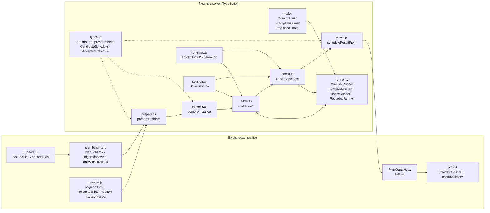
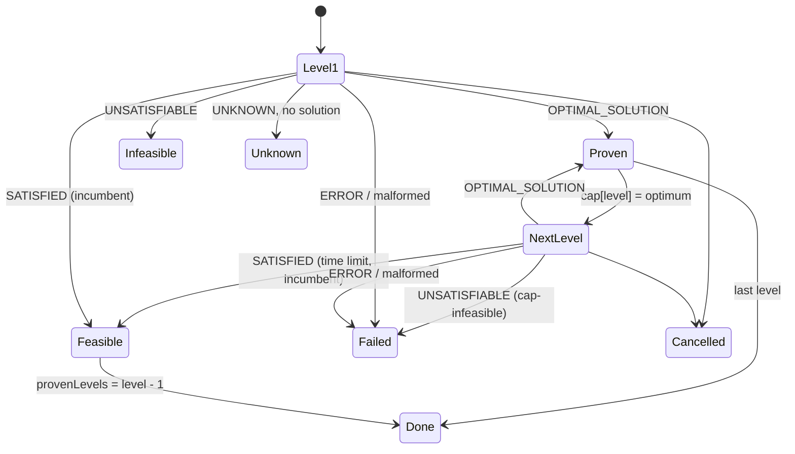
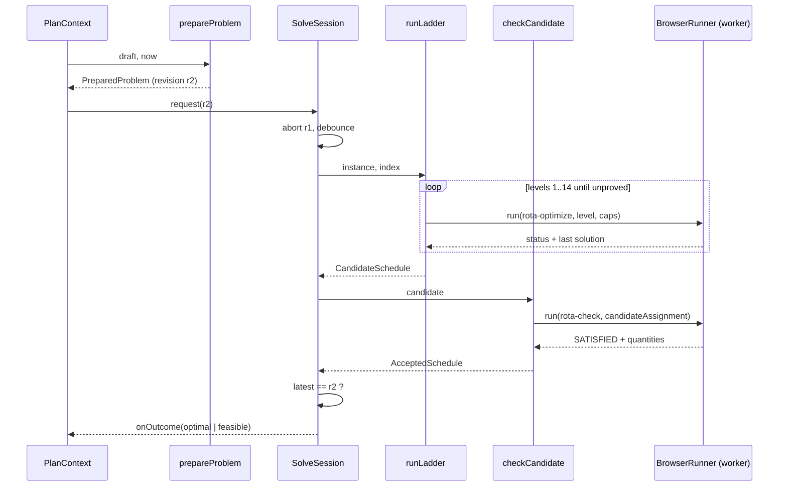
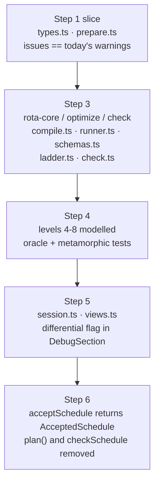

# MiniZinc implementation design for ADR 017

- Status: **Design only, nothing implemented.** Resolves ADR 017's decision to
  the class and function level for the MiniZinc path: migration steps 3 to 6,
  plus the slice of step 1 the solver needs. History as its own domain value
  (step 2) is named where the solver touches it and otherwise left to its own
  design.
- Date: 2026-09-16
- Reads with: ADR 011 (the model and its measurements), ADR 017 (the
  boundaries), `prototype/minizinc/README.md` (what has been measured).

Every name below is a proposal for a symbol that does not exist yet. Where a
function already exists and is reused, its current file is named so nothing
here is mistaken for a second implementation of it.

## What is being built



The engine in `planner.js` stays the production authority until step 6. The
new modules run beside it behind a flag first (step 5), then replace
`acceptSchedule`'s call into it.

## 1. Types (`src/solver/types.ts`)

Branded scalars, each with a Zod constructor in `schemas.ts`:

| Brand             | Underlying | Constructed by                 |
|-------------------|------------|--------------------------------|
| `EmployeeId`      | string     | `employeeIdSchema`             |
| `MissionId`       | string     | `missionIdSchema`              |
| `QualificationId` | string     | `qualificationIdSchema`        |
| `InstantMs`       | number     | `instantSchema` (finite int)   |
| `DurationMinutes` | number     | `durationMinutesSchema` (≥ 0)  |
| `SegmentIndex`    | number     | `segmentIndexSchema` (1-based) |
| `ProblemRevision` | string     | `revisionOf` (see §9)          |

Domain values, as `readonly` interfaces:

```ts
interface PreparedEmployee {
  id: EmployeeId;
  available: Interval;                 // clamped to the horizon
  qualifications: ReadonlySet<QualificationId>;
  requiredNightRestMinutes: DurationMinutes; // 0 when nothing applies
  memory: DutyMemory;                  // what the log says, §2
}

interface DutyMemory {                 // read from logged duty inside memoryDays
  idleMinutesAtHorizonStart: DurationMinutes; // since the last logged duty, capped
  turns: number;
  nightMinutes: DurationMinutes;
  turnsOnMission: ReadonlyMap<MissionId, number>;
  heldWithinCooldown: ReadonlySet<MissionId>;
  hourHolds: readonly number[];        // 24 counts: turns begun in each hour of day
}

type PreparedMission =
  | { kind: 'local'; id: MissionId; window: Interval; daySeats: number; nightSeats: number;
      slotBounds: readonly InstantMs[]; requires: readonly Requirement[];
      exclusions: Exclusions; onCall: boolean; repeatAfterDays: number | null }
  | { kind: 'remote'; id: MissionId; window: Interval; seats: number;
      requires: readonly Requirement[]; exclusions: Exclusions; onCall: boolean;
      repeatAfterDays: number | null }
  | { kind: 'daily'; id: MissionId; occurrences: readonly Interval[]; seats: number;
      requires: readonly Requirement[]; exclusions: Exclusions; onCall: boolean;
      repeatAfterDays: number | null };

// `repeatAfterDays` is the once-per-rotation rule (decision G): kitchen duty
// with 7 means nobody takes it twice inside seven days if anyone else can.

interface Commitment {               // a manual pin or a logged record, resolved
  employeeId: EmployeeId;
  missionId: MissionId;
  coverage: Interval;                // literal instants, never null
  provenance: 'manual' | 'logged';
}

interface PreparedProblem {
  horizon: Interval;
  loggedBefore: InstantMs;
  nights: readonly Interval[];       // viewer-timezone, resolved
  employees: readonly PreparedEmployee[];
  missions: readonly PreparedMission[];
  commitments: readonly Commitment[];
  memoryDays: number;                // how far back the log is read, default 21
  issues: readonly PreparationIssue[];
  revision: ProblemRevision;
}
```

Solver-side values:

```ts
interface SolverInstance { /* the JSON handed to MiniZinc, §3 */ }

interface InstanceIndex {            // how to read the answer back
  segments: readonly Interval[];     // global grid, 1-based on the model side
  employeeIds: readonly EmployeeId[];
  missionIds: readonly MissionId[];
  slotOfSegment: number[][];         // [missionIndex][segmentIndex]
  holdOfSegment: number[][];
}

interface CandidateSchedule {
  revision: ProblemRevision;
  assignment: Uint8Array;            // employeeCount × segmentCount, 0 = off duty
  claimed: NamedQuantities;          // what optimize mode reported
  provenLevels: number;              // 0..LEVEL_COUNT
}

interface AcceptedSchedule {
  revision: ProblemRevision;
  assignment: Uint8Array;            // identical to the candidate's
  quantities: NamedQuantities;       // what CHECK mode recomputed
  diagnostics: SegmentDiagnostics;   // per-cell outputs of check mode, §4.6
  proof: 'optimal' | 'feasible';
  provenLevels: number;
}

type SolveOutcome =
  | { kind: 'optimal';    accepted: AcceptedSchedule }
  | { kind: 'feasible';   accepted: AcceptedSchedule }
  | { kind: 'infeasible'; revision: ProblemRevision; level: 1 }
  | { kind: 'unknown';    revision: ProblemRevision; level: number }
  | { kind: 'cancelled';  revision: ProblemRevision }
  | { kind: 'failed';     revision: ProblemRevision; reason: FailureReason; detail: string };

type FailureReason = 'model-error' | 'worker' | 'malformed-output'
  | 'dimension-mismatch' | 'objective-mismatch' | 'cap-infeasible' | 'stale-revision';
```

`assignment` is a flat `Uint8Array` indexed `employee * segmentCount + segment`,
0-based on this side. One byte per cell is the representation ADR 017 asks for:
a cell holds one mission index or zero, so two missions in one cell cannot be
written. `missionCount` is bounded to 255 by `schemas.ts`; a document with more
missions than that is a preparation issue, not a runtime surprise.

`freezePastShifts` and every history function accept `AcceptedSchedule` and
nothing wider. `CandidateSchedule` has no method that yields rows.

## 2. Preparation (`src/solver/prepare.ts`)

```ts
function prepareProblem(draft: DraftPlan, clock: { now: InstantMs }): PreparedProblem
```

`DraftPlan` is what `planSchema.parse` returns today; the strict draft schema is
step 1's concern and does not gate this module. `prepareProblem` never throws
on a half-typed document. It reuses the existing rules rather than restating
them, so each helper below is a thin function over an export that already
exists:

| Helper                         | Reuses                                                      | Adds                                                                                                                                                                                                                                 |
|--------------------------------|-------------------------------------------------------------|--------------------------------------------------------------------------------------------------------------------------------------------------------------------------------------------------------------------------------------|
| `resolveNights(draft)`         | `nightWindows` (planSchema.js)                              | nothing                                                                                                                                                                                                                              |
| `resolveOccurrences(draft,m)`  | `dailyOccurrences` (planSchema.js)                          | issue `daily-missing-clock` when a bound is null                                                                                                                                                                                     |
| `resolveEmployees(draft)`      | `normalizeEmployees` via `segmentGrid`'s `prepare`          | `requiredNightRestMinutes` from `tags[].minNightRestMinutes`                                                                                                                                                                         |
| `resolveMissions(draft)`       | `normalizeMissions`, `slotBoundsFor` via `segmentGrid`      | the discriminated union; issues `mission-outside-window`, `tag-required-and-excluded`                                                                                                                                                |
| `resolveCommitments(draft)`    | `acceptedPins` (planner.js)                                 | provenance; issues `pin-conflict`, `pin-overflow`, `pin-unavailable`, `pin-availability-overridden`                                                                                                                                  |
| `countStaleCommitments(draft)` | `isOutOfPeriod`, `isElapsedBeforePeriod`                    | issue `pin-out-of-period` with `count` and `elapsed`                                                                                                                                                                                 |
| `readDutyMemory(draft)`        | `isElapsedBeforePeriod`, `resolvePinWindow`, `nightWindows` | one `DutyMemory` per employee from the logged duty inside `memoryDays`: idle minutes at the start (capped at eight hours), turns, night minutes, turns per mission, missions held inside their cooldown, turns begun per hour of day |

**The log is the memory, and nothing clears it.** The owner wants export
and no clear button, so logged duty stays in the document and `readDutyMemory`
reads it directly. There is no `carriedMinutes`, `carriedStints` or
`lastDutyEnd`: every number the model needs about the past is derived from
the rows themselves at preparation time, so nothing has to be stamped when a
window rolls. `clearStalePins`, `countStalePins` and the clear half of the
export button go at step 6; `outOfPeriodLog` and the CSV export stay as they
are. The `pin-out-of-period` issue becomes purely informational.

The window is 24 hours by default, which `emptyPlan()` already writes;
ADR 012's 72 is amended. The memory reaches further back than the window:
`memoryDays` defaults to 21, the longest once-per-rotation cooldown, and every
memory quantity is read over that span. The wait before a turn is the one
number capped short, at eight hours, because after a night's sleep it no
longer matters when somebody last stood post (decision A).

What that costs is document size, and it is worth a number. ADR 012 measured
about ten characters of link per logged assignment. Ten seats held hourly for
21 days is roughly 5,000 assignments, so a link of about 50,000 characters:
fine for the browser, too long to paste into a chat. That is open question I.

`PreparationIssue` is a discriminated union keyed on `code`, with the same
codes and fields the engine's warnings carry today, so `findings.js` renders
them unchanged.

**Compatibility is owed to names and qualifications, nothing else.** The
owner has set aside backwards compatibility for every other part of a shared
link. So the wire format takes a `SCHEMA_VERSION` bump when this lands, and
`decodePlan` gains one migration, `migrateLegacyPlan(raw)`, that keeps the
employee list (id, name, qualification ids) and the qualification
definitions, and starts everything else from `emptyPlan()`: missions, pins,
period, night bounds. The `strategy` field, `carriedMinutes`, `carriedStints`
and ADR 006's append-only tuple discipline go; `repeatAfterDays` on a mission
and `memoryDays` on the plan are ordinary fields. ADR 006 is amended when the
bump lands, and `tests/urlState.test.js`'s literal blob becomes a test of
the migration rather than of byte identity.

Two rules are the solver's and live here rather than in the model:

- **Elapsed, recorded segments keep their own headcount** (ADR 009). For a
  local segment ending before `loggedBefore` that at least one commitment
  covers, `seatsWanted` is the number of committed people, not today's count.
  Nothing is demanded there and nothing can be evicted. An elapsed segment with
  no record is prepared like any other.
- **A remote commitment is the whole mission**, whatever range was written.
  `acceptedPins` already widens it; preparation keeps that.

`prepareProblem` is pure. `now` enters here as `loggedBefore`, exactly as it
enters `toPlannerInput` today, and nowhere else in `src/solver`.

## 3. Compilation (`src/solver/compile.ts`)

```ts
function compileInstance(problem: PreparedProblem): { instance: SolverInstance; index: InstanceIndex }
```

The successor of `prototype/minizinc/fromPlan.mjs::toInstance`, split into
functions that can be tested one at a time:

```ts
function buildGlobalSegmentGrid(problem): { segments: Interval[]; edges: InstantMs[] }
// Union of every mission's own edges: local missions contribute segmentGrid's
// segments, remote and daily missions contribute window edges only, employees
// contribute availability edges, nights contribute their edges. Sorted, deduped.

function seatsWantedMatrix(problem, segments): number[][]
// countAt(mission, segment.start, nights), 0 outside the mission's windows,
// the recorded headcount on an elapsed recorded segment (§2).

function slotAndHoldMatrices(problem, segments): { slotOfSegment: number[][]; holdOfSegment: number[][] }
// Local: the slot id from the mission's own grid (never recomputed).
// Remote: one hold id for the mission. Daily: one hold id per occurrence.
// Ids are unique across missions, so a slot and a hold can never collide.

function availabilityMatrix(problem, segments): boolean[][]
function allowedMatrix(problem): boolean[][]

function commitmentTriples(problem, index): { pinEmployee: number[]; pinMission: number[]; pinSegment: number[] }
// One triple per (commitment, covered segment). Two triples naming the same
// cell with different missions are NOT merged: the model reports infeasible.

function requirementTables(problem, index): { requirementMission: number[]; requirementSeats: number[]; holdsRequirement: boolean[][] }

function nightOfSegment(problem, segments): number[]
// 0 for a day segment, else the 1-based index of the night it lies in.

function memoryTables(problem, index): MemoryTables
// The DutyMemory of every employee laid out as the model's arrays:
// idleMinutesAtHorizonStart, recentTurns, recentNightMinutes,
// recentTurnsOnMission, heldWithinCooldown, recentHourHolds, plus
// repeatAfterDays per mission (0 = none) and hourOfSegment per segment.

function enumerateLongRunWindows(segments, capMinutes = MAX_UNBROKEN_MINUTES): { first: number[]; last: number[] }
// Every minimal window of consecutive segments whose minutes exceed the cap:
// for each first segment, the smallest last segment past the cap. Linear in
// segmentCount. MAX_UNBROKEN_MINUTES is imported from strategies.js so ADR 016's
// number has one definition.

function enumerateSleepWindows(segments, nightOfSegment, minutes = TARGET_REST_MINUTES): { first: number[]; last: number[]; night: number[] }
// Every minimal window of consecutive segments inside one night whose minutes
// reach the eight-hour target. The same shape as the long-run windows, read
// the other way round: a person off duty across one of these has slept.

function deriveSymmetryClasses(instance): number[]
// Same rule as prototype/minizinc/solve.mjs::symClasses, on the new arrays:
// identical availability row, allowed row, qualification column, the whole
// DutyMemory and rest requirement, and no commitment anywhere. 0 = singleton. The cap makes most of a rested roster
// identical at the start, which is exactly when symmetry breaking pays.

function instanceToJsonData(instance, ladder: LadderParams): object
// The object handed to Model.addJson. Nested arrays for 2-D parameters;
// 0..0 arrays are emitted as [] for empty pin and requirement lists.
```

`SolverInstance` is exactly the parameter list of `rota-core.mzn` in §4.1,
with the same names, so a reader can hold the two side by side.

Time is a segment index on the model side and `segmentMinutes` carries every
duration. Nothing epoch-sized crosses the boundary.

## 4. The model (`src/solver/model/`)

Three files. `rota-core.mzn` declares parameters, the decision, the hard rules
and every named quantity. The two entry files each `include` it and add only a
`solve` item and, for check mode, the fixing constraint.

### 4.1 `rota-core.mzn`

```minizinc
% Guard rota: one assignment matrix over the global segment grid (ADR 017).
% Time is a segment index; every duration is `segmentMinutes`.

include "lex_lesseq.mzn";

int: MODEL_VERSION = 1;
int: LEVEL_COUNT = 14;
int: OFF_DUTY = 0;

% ---- sizes ----------------------------------------------------------------
int: employeeCount;
int: missionCount;
int: segmentCount;
int: nightCount;
int: pinCount;
int: requirementCount;
int: longRunWindowCount;
int: sleepWindowCount;

set of int: Employees      = 1..employeeCount;
set of int: Missions       = 1..missionCount;
set of int: MissionOrOff   = 0..missionCount;
set of int: Segments       = 1..segmentCount;
set of int: Nights         = 1..nightCount;
set of int: Pins           = 1..pinCount;
set of int: Requirements   = 1..requirementCount;
set of int: LongRunWindows = 1..longRunWindowCount;
set of int: SleepWindows   = 1..sleepWindowCount;
set of int: Levels         = 1..LEVEL_COUNT;
set of int: Hours          = 0..23;

% ---- the grid -------------------------------------------------------------
array[Segments] of int: segmentMinutes;
array[Segments] of int: nightOfSegment;          % 0 = day
array[Missions, Segments] of int: seatsWanted;   % 0 = not running
array[Missions, Segments] of int: slotOfSegment; % rotation slot, 0 = none
array[Missions, Segments] of int: holdOfSegment; % indivisible hold, 0 = none

% ---- people ---------------------------------------------------------------
array[Employees, Segments] of bool: isAvailable;
array[Employees, Missions] of bool: isAllowed;   % not excluded by tag or name

% ---- what the log says about the memory horizon (§2) ----------------------
array[Employees] of int: idleMinutesAtHorizonStart; % since the last logged duty, capped
array[Employees] of int: recentTurns;
array[Employees] of int: recentNightMinutes;
array[Employees, Missions] of int: recentTurnsOnMission;
array[Employees, Missions] of bool: heldWithinCooldown;
array[Employees, Hours] of int: recentHourHolds;    % turns begun at that hour of day
array[Segments] of int: hourOfSegment;              % 0..23, at the segment's start
array[Missions] of int: repeatAfterDays;            % 0 = no once-per-rotation rule
array[Employees] of int: requiredNightRestMinutes; % 0 = no requirement
array[Employees] of int: symmetryClass;          % 0 = nobody else is like me

% ---- missions -------------------------------------------------------------
array[MissionOrOff] of bool: isSleepable;        % index OFF_DUTY is true

% ---- commitments: manual pins and logged duty, one row per covered cell ---
array[Pins] of Employees: pinEmployee;
array[Pins] of Missions:  pinMission;
array[Pins] of Segments:  pinSegment;

% ---- qualification requirements -------------------------------------------
array[Requirements] of Missions: requirementMission;
array[Requirements] of int: requirementSeats;
array[Requirements, Employees] of bool: holdsRequirement;

% ---- windows longer than the unbroken-run cap (ADR 016) -------------------
array[LongRunWindows] of Segments: longRunFirstSegment;
array[LongRunWindows] of Segments: longRunLastSegment;

% ---- windows inside one night long enough for the target night's sleep ----
array[SleepWindows] of Segments: sleepWindowFirstSegment;
array[SleepWindows] of Segments: sleepWindowLastSegment;
array[SleepWindows] of Nights:   sleepWindowNight;

% ---- the ladder (optimize mode reads these; check mode ignores them) ------
int: objectiveLevel;
array[Levels] of int: objectiveCap;              % -1 = uncapped

% ---- the decision ---------------------------------------------------------
% One cell, one mission. Double booking is not a value this array can hold.
array[Employees, Segments] of var MissionOrOff: assignedMission :: output;

% ---- derived views of the decision ---------------------------------------
array[Employees, Missions, Segments] of var bool: isOnMission =
  array3d(Employees, Missions, Segments, [
    assignedMission[employee, segment] == mission
    | employee in Employees, mission in Missions, segment in Segments ]);

array[Employees, Segments] of var bool: isOnDuty =
  array2d(Employees, Segments, [
    assignedMission[employee, segment] != OFF_DUTY
    | employee in Employees, segment in Segments ]);

array[Employees, Segments] of bool: isPinnedCell =
  array2d(Employees, Segments, [
    exists(pin in Pins)(pinEmployee[pin] == employee /\ pinSegment[pin] == segment)
    | employee in Employees, segment in Segments ]);

array[Missions, Segments] of var 0..employeeCount: seatsFilled :: output =
  array2d(Missions, Segments, [
    sum(employee in Employees)(isOnMission[employee, mission, segment])
    | mission in Missions, segment in Segments ]);

% ---- hard rules -----------------------------------------------------------
% A commitment is a fact. Two commitments on one cell make the instance
% infeasible rather than one of them disappearing.
constraint forall(pin in Pins)(
  assignedMission[pinEmployee[pin], pinSegment[pin]] == pinMission[pin]);

% Availability and exclusions bind every cell a person did not commit by hand.
constraint forall(employee in Employees, segment in Segments
    where not isAvailable[employee, segment] /\ not isPinnedCell[employee, segment])(
  assignedMission[employee, segment] == OFF_DUTY);

constraint forall(employee in Employees, mission in Missions, segment in Segments
    where not isAllowed[employee, mission] /\ not isPinnedCell[employee, segment])(
  assignedMission[employee, segment] != mission);

% Nobody stands a mission that is not running.
constraint forall(employee in Employees, mission in Missions, segment in Segments
    where seatsWanted[mission, segment] == 0)(
  assignedMission[employee, segment] != mission);

% A mission never holds more people than it wants.
constraint forall(mission in Missions, segment in Segments)(
  seatsFilled[mission, segment] <= seatsWanted[mission, segment]);

% Crew inside a hold cannot change: a remote mission end to end, a daily
% occurrence whole.
constraint forall(employee in Employees, mission in Missions, segment in 2..segmentCount
    where holdOfSegment[mission, segment] > 0
       /\ holdOfSegment[mission, segment] == holdOfSegment[mission, segment - 1])(
  isOnMission[employee, mission, segment] == isOnMission[employee, mission, segment - 1]);

% Interchangeable people are ordered, so the solver does not walk their
% permutations. Prunes nothing real: members of a class can be swapped without
% changing any quantity below.
constraint forall(employee in 1..employeeCount - 1
    where symmetryClass[employee] > 0
       /\ symmetryClass[employee] == symmetryClass[employee + 1])(
  lex_lesseq([assignedMission[employee + 1, segment] | segment in Segments],
             [assignedMission[employee,     segment] | segment in Segments]));

% ---- named quantities -----------------------------------------------------
% Every floor is declared. MiniZinc does not fold the headcount rule into the
% inferred bounds of a `seatsWanted - seatsFilled` sum, and an unbounded
% objective turns a millisecond optimum into minutes of failed proof.

% The one rest number the owner optimises for: eight hours off. Six hours is
% not a constant here; it is the configured per-qualification minimum
% (`requiredNightRestMinutes`, six by default for drivers), a strongly
% suggested floor the user may lower in a pinch, and it is enforced only as
% level 4 below coverage, with the shortfall reported in actual minutes.
int: TARGET_REST_MINUTES = 480;

int: horizonMinutes = sum(segment in Segments)(segmentMinutes[segment]);
int: totalSeatMinutes = sum(mission in Missions, segment in Segments)(
  seatsWanted[mission, segment] * segmentMinutes[segment]);
int: totalRequirementMinutes = sum(requirement in Requirements, segment in Segments
    where seatsWanted[requirementMission[requirement], segment] > 0)(
  requirementSeats[requirement] * segmentMinutes[segment]);
int: totalNightMinutes = sum(segment in Segments where nightOfSegment[segment] > 0)(
  segmentMinutes[segment]);

% Level 1: required qualifications not covered, in seat-minutes.
array[Requirements, Segments] of var 0..employeeCount: qualifiedSeatsFilled :: output =
  array2d(Requirements, Segments, [
    sum(employee in Employees where holdsRequirement[requirement, employee])(
      isOnMission[employee, requirementMission[requirement], segment])
    | requirement in Requirements, segment in Segments ]);

var 0..totalRequirementMinutes: unmetQualificationMinutes :: output =
  sum(requirement in Requirements, segment in Segments
      where seatsWanted[requirementMission[requirement], segment] > 0)(
    max(0, requirementSeats[requirement] - qualifiedSeatsFilled[requirement, segment])
      * segmentMinutes[segment]);

% Level 2: seats left empty, in seat-minutes.
var 0..totalSeatMinutes: unfilledSeatMinutes :: output =
  sum(mission in Missions, segment in Segments)(
    (seatsWanted[mission, segment] - seatsFilled[mission, segment]) * segmentMinutes[segment]);

% Level 3: crew changing hands between two segments of one rotation slot.
% Soft, because a commitment covering half a slot must be able to hand over at
% its own edge. Above rest on purpose: a rest preference must never create a
% shift boundary (AGENTS.md).
var 0..employeeCount * missionCount * segmentCount: slotHandoverCount :: output =
  sum(employee in Employees, mission in Missions, segment in 2..segmentCount
      where seatsWanted[mission, segment] > 0
         /\ seatsWanted[mission, segment - 1] > 0
         /\ slotOfSegment[mission, segment] == slotOfSegment[mission, segment - 1])(
    isOnMission[employee, mission, segment] != isOnMission[employee, mission, segment - 1]);

% Rest is measured inside the night and inside the person's own availability,
% exactly as rest.js measures it. On-call duty is slept through (ADR 007).
array[Employees, Segments] of var bool: isAwakeOnDuty =
  array2d(Employees, Segments, [
    not isSleepable[assignedMission[employee, segment]]
    | employee in Employees, segment in Segments ]);

array[Employees, Nights] of var 0..totalNightMinutes: nightRestMinutes :: output =
  array2d(Employees, Nights, [
    sum(segment in Segments
        where nightOfSegment[segment] == night /\ isAvailable[employee, segment])(
      segmentMinutes[segment] * (1 - isAwakeOnDuty[employee, segment]))
    | employee in Employees, night in Nights ]);

% Level 4: shortfall against the configured per-qualification minimum.
var 0..employeeCount * nightCount * totalNightMinutes: restShortfallMinutes :: output =
  sum(employee in Employees, night in Nights where requiredNightRestMinutes[employee] > 0)(
    max(0, requiredNightRestMinutes[employee] - nightRestMinutes[employee, night]));

% Level 5: shortfall against eight hours off in total, for everyone present.
% A configured minimum above eight ratchets the target up, never down.
array[Employees, Nights] of bool: isPresentForNight =
  array2d(Employees, Nights, [
    exists(segment in Segments where nightOfSegment[segment] == night)(
      isAvailable[employee, segment])
    | employee in Employees, night in Nights ]);

var 0..employeeCount * nightCount * totalNightMinutes: targetRestShortfallMinutes :: output =
  sum(employee in Employees, night in Nights where isPresentForNight[employee, night])(
    max(0, max(requiredNightRestMinutes[employee], TARGET_REST_MINUTES)
             - nightRestMinutes[employee, night]));

% Level 6: as many people as possible sleep the full eight hours in one
% stretch (decision B). Everyone counts, not only people with a rest
% requirement, and a night the person is not present for eight hours of is
% not held against the schedule.
array[Employees, Nights] of bool: canSleepTarget =
  array2d(Employees, Nights, [
    exists(window in SleepWindows where sleepWindowNight[window] == night)(
      forall(segment in sleepWindowFirstSegment[window]..sleepWindowLastSegment[window])(
        isAvailable[employee, segment]))
    | employee in Employees, night in Nights ]);

array[Employees, Nights] of var bool: sleepsTarget :: output =
  array2d(Employees, Nights, [
    exists(window in SleepWindows where sleepWindowNight[window] == night)(
      forall(segment in sleepWindowFirstSegment[window]..sleepWindowLastSegment[window])(
        isAvailable[employee, segment] /\ not isAwakeOnDuty[employee, segment]))
    | employee in Employees, night in Nights ]);

var 0..employeeCount * nightCount: nightsWithoutTargetSleep :: output =
  sum(employee in Employees, night in Nights where canSleepTarget[employee, night])(
    1 - sleepsTarget[employee, night]);

% Level 7: unbroken runs past the cap (ADR 016). One per (person, window)
% fully on duty. Soft, so a roster with nobody spare still gets an answer.
array[Employees] of var 0..longRunWindowCount: longRunsByEmployee :: output =
  [ sum(window in LongRunWindows)(
      forall(segment in longRunFirstSegment[window]..longRunLastSegment[window])(
        isOnDuty[employee, segment]))
    | employee in Employees ];
var 0..employeeCount * longRunWindowCount: longRunCount :: output = sum(longRunsByEmployee);

% Level 8: a mission everyone hates comes round once per rotation (decision
% G). A mission with `repeatAfterDays` set, kitchen say, costs one for every
% person who takes it while their last logged turn on it is inside the
% cooldown, and one more for every extra turn on it inside this window. The
% cooldown is measured from the log to the horizon start (§2), an
% approximation of at most one window's length, which on a 24-hour plan is one
% day. Above round robin on purpose: this decides who is eligible for the
% kitchen, the wait decides who goes next among them.
array[Employees, Missions] of var 0..segmentCount: turnsOnMission :: output =
  array2d(Employees, Missions, [
    sum(segment in Segments
        where seatsWanted[mission, segment] > 0
           /\ (if segment == 1 then true
               else slotOfSegment[mission, segment] != slotOfSegment[mission, segment - 1]
                 \/ holdOfSegment[mission, segment] != holdOfSegment[mission, segment - 1]
               endif))(
      isOnMission[employee, mission, segment])
    | employee in Employees, mission in Missions ]);

var 0..employeeCount * missionCount * (segmentCount + 1): cooldownBreachCount :: output =
  sum(employee in Employees, mission in Missions where repeatAfterDays[mission] > 0)(
    bool2int(heldWithinCooldown[employee, mission]) * bool2int(turnsOnMission[employee, mission] >= 1)
    + max(0, turnsOnMission[employee, mission] - 1));

% Level 9: fairness is round robin, and nothing else (decision A, decision E).
% Whoever has waited longest goes next, and somebody back from a long mission
% goes to the end of the queue. Hours are never consulted; `dutyMinutes` is
% reported for the summary table and optimised nowhere.
array[Employees] of var 0..horizonMinutes: dutyMinutes :: output =
  [ sum(segment in Segments)(segmentMinutes[segment] * isOnDuty[employee, segment])
    | employee in Employees ];
 Stated globally rather than
% one slot at a time: the shortest wait before any turn the solver chose is as
% long as it can be. A committed cell is not the solver's choice, so the wait
% before it is not scored.
%
% A wait is capped at the eight-hour target. After a night's sleep it no
% longer matters when somebody last stood post (the owner's words), and most
% plans are a day or less, so the queue only has to remember the last eight
% hours. Any eight hours off counts, not only a night: on a horizon this short
% an eight-hour break is a night's sleep in practice, and the cap keeps every
% domain here small.

% Minutes off duty running up to each segment, capped: the idle time at the
% horizon start, then a stretch that resets to zero after every on-duty
% segment and stops growing at the cap.
array[Employees, Segments] of var 0..TARGET_REST_MINUTES: idleMinutesBefore;
constraint forall(employee in Employees)(
  idleMinutesBefore[employee, 1] == min(TARGET_REST_MINUTES, idleMinutesAtHorizonStart[employee]));
constraint forall(employee in Employees, segment in 2..segmentCount)(
  idleMinutesBefore[employee, segment] ==
    min(TARGET_REST_MINUTES,
        (1 - isOnDuty[employee, segment - 1])
          * (idleMinutesBefore[employee, segment - 1] + segmentMinutes[segment - 1])));

array[Employees, Segments] of var bool: startsChosenTurn =
  array2d(Employees, Segments, [
    isOnDuty[employee, segment]
    /\ (if segment == 1 then true else not isOnDuty[employee, segment - 1] endif)
    /\ not isPinnedCell[employee, segment]
    | employee in Employees, segment in Segments ]);

var 0..TARGET_REST_MINUTES: shortestWaitMinutes :: output;
constraint forall(employee in Employees, segment in Segments)(
  startsChosenTurn[employee, segment] -> shortestWaitMinutes <= idleMinutesBefore[employee, segment]);
% Minimised, so the wait is maximised. Zero means everyone the solver chose
% had eight hours off first; from there the queue is turns alone (level 10).
% With no chosen turn at all the level is trivially proved.
var 0..TARGET_REST_MINUTES: waitDeficitMinutes :: output = TARGET_REST_MINUTES - shortestWaitMinutes;

% Level 10: once the bottleneck wait is settled, turns are shared out, the
% turns the log remembers included. A turn is one distinct rotation slot
% entered, plus one per hold.
array[Employees] of var 0..missionCount * segmentCount: turnsTaken :: output =
  [ sum(mission in Missions)(turnsOnMission[employee, mission]) | employee in Employees ];
int: maxRecentTurns = max([0] ++ recentTurns);
array[Employees] of var int: totalTurns =
  [ turnsTaken[employee] + recentTurns[employee] | employee in Employees ];
var 0..missionCount * segmentCount + maxRecentTurns: turnSpread :: output =
  max(totalTurns) - min(totalTurns);

% Level 11: prefer distinct people for distinct required roles. A person on a
% mission holding more than one of its required qualifications costs the
% surplus, so a driver who is also the commander is chosen only when nobody
% else can hold the second seat. An approximation, recorded as one.
var 0..employeeCount * segmentCount * requirementCount: sharedRoleCount :: output =
  sum(employee in Employees, mission in Missions, segment in Segments
      where seatsWanted[mission, segment] > 0)(
    isOnMission[employee, mission, segment]
      * max(0, sum(requirement in Requirements
                   where requirementMission[requirement] == mission)(
                 holdsRequirement[requirement, employee]) - 1));

% Level 12: night is much harder than day, so night duty is evened out over
% the memory horizon, not only inside this window (decision H). Somebody who
% only ever stands 01:00 while another only ever stands 13:00 is what this
% level exists to stop.
array[Employees] of var 0..totalNightMinutes: nightMinutesInWindow :: output =
  [ sum(segment in Segments where nightOfSegment[segment] > 0)(
      segmentMinutes[segment] * isOnDuty[employee, segment])
    | employee in Employees ];
int: maxRecentNightMinutes = max([0] ++ recentNightMinutes);
array[Employees] of var int: totalNightMinutesHeld =
  [ nightMinutesInWindow[employee] + recentNightMinutes[employee] | employee in Employees ];
var 0..totalNightMinutes + maxRecentNightMinutes: nightDutySpreadMinutes :: output =
  max(totalNightMinutesHeld) - min(totalNightMinutesHeld);

% Level 13: rotate people across missions (decision H). Every turn on a
% mission costs the number of turns the log already shows that person on that
% mission, so whoever has done it least lately is the cheapest to send. With
% enough drivers this is what swaps who takes the morning and the night
% patrol, and what sends somebody on patrol one day and to the gate the next.
int: missionRepeatCeiling = segmentCount
  * sum(employee in Employees, mission in Missions)(recentTurnsOnMission[employee, mission]);
var 0..missionRepeatCeiling: missionRepeatCost :: output =
  sum(employee in Employees, mission in Missions)(
    recentTurnsOnMission[employee, mission] * turnsOnMission[employee, mission]);

% Level 14: not the same person at the same night hour every night (decision
% H). Standing a night segment costs the number of turns the log shows that
% person beginning at that hour of the day, so the 01:00 post moves around.
int: nightHourRepeatCeiling = segmentCount
  * sum(employee in Employees, hour in Hours)(recentHourHolds[employee, hour]);
var 0..nightHourRepeatCeiling: nightHourRepeatCost :: output =
  sum(employee in Employees, segment in Segments where nightOfSegment[segment] > 0)(
    recentHourHolds[employee, hourOfSegment[segment]] * isOnDuty[employee, segment]);

% ---- the ladder -----------------------------------------------------------
array[Levels] of var int: objectives = [
  unmetQualificationMinutes,      % 1  coverage
  unfilledSeatMinutes,            % 2  coverage
  slotHandoverCount,              % 3  a slot is stood whole
  restShortfallMinutes,           % 4  the configured minimum
  targetRestShortfallMinutes,     % 5  eight hours off in total, everyone
  nightsWithoutTargetSleep,       % 6  eight hours in one stretch, for as many as possible
  longRunCount,                   % 7  nobody stands six hours if anyone is free
  cooldownBreachCount,            % 8  kitchen once per rotation
  waitDeficitMinutes,             % 9  the longest wait (round robin)
  turnSpread,                     % 10 turns shared out
  sharedRoleCount,                % 11 distinct people for distinct roles
  nightDutySpreadMinutes,         % 12 night duty evened out over the memory
  missionRepeatCost,              % 13 rotate people across missions
  nightHourRepeatCost             % 14 not the same night hour every night
];

constraint forall(level in Levels where objectiveCap[level] >= 0)(
  objectives[level] <= objectiveCap[level]);

var int: echoedModelVersion :: output = MODEL_VERSION;
```

The `:: output` annotations, together with `output-mode json`, are the whole
output contract: no `output` item, no text to parse. Everything not annotated
stays internal.

### 4.2 `rota-optimize.mzn`

```minizinc
include "rota-core.mzn";
solve :: int_search([assignedMission[employee, segment] | employee in Employees, segment in Segments],
                    first_fail, indomain_min)
      minimize objectives[objectiveLevel];
```

The search annotation is a hint only; the runner passes `free-search`, which
is what the prototype found necessary and which HiGHS ignores anyway.

### 4.3 `rota-check.mzn`

```minizinc
include "rota-core.mzn";
array[Employees, Segments] of MissionOrOff: candidateAssignment;
constraint forall(employee in Employees, segment in Segments)(
  assignedMission[employee, segment] == candidateAssignment[employee, segment]);
solve satisfy;
```

Same rules, same quantities, one extra constraint, no objective. `objectiveCap`
is passed as all `-1` and `objectiveLevel` as `1` so the core's parameters are
satisfied without affecting the question.

### 4.4 Data shape, per run

Every run receives the instance plus:

| Parameter             | Optimize mode                              | Check mode             |
|-----------------------|--------------------------------------------|------------------------|
| `objectiveLevel`      | the level being minimised                  | `1` (unused)           |
| `objectiveCap`        | proven optima of earlier levels, else `-1` | all `-1`               |
| `candidateAssignment` | absent                                     | the candidate's matrix |

### 4.5 What the prototype loses and gains

Relative to `prototype/minizinc/rota.mzn`: the Boolean cube becomes the matrix;
`x`, `nE`, `nM`, `nS`, `want`, `avail`, `allowed`, `pinned`, `reqHolds` become
the names above; `unfilledSeats` and `unmetQualifications` become seat-minutes;
churn and imbalance keep their meaning under new names; rest, unbroken runs,
turns and shared roles are new. `check.mjs`'s oracle is ported to the matrix
in `tests/solver.oracle.test.js` (§13) rather than kept beside the prototype.

### 4.6 Diagnostics the model outputs

`seatsFilled`, `qualifiedSeatsFilled`, `nightRestMinutes`, `sleepsTarget`,
`longRunsByEmployee`, `dutyMinutes`, `turnsTaken`, `turnsOnMission`,
`nightMinutesInWindow` and `shortestWaitMinutes`
are outputs so the UI's findings are a *reading* of MiniZinc's answer.
`SegmentDiagnostics` in `types.ts` is exactly these arrays, typed and
dimension-checked.

## 5. Runner (`src/solver/runner.ts`)

```ts
interface RunRequest {
  entry: 'rota-optimize.mzn' | 'rota-check.mzn';
  data: object;                       // instanceToJsonData(...)
  timeLimitMs: number;
}

type MiniZincStatus = 'OPTIMAL_SOLUTION' | 'SATISFIED' | 'ALL_SOLUTIONS'
  | 'UNSATISFIABLE' | 'UNBOUNDED' | 'UNSAT_OR_UNBOUNDED' | 'UNKNOWN' | 'ERROR';

type RunResult =
  | { kind: 'finished'; status: MiniZincStatus; lastSolution: unknown | null; statistics: Record<string, unknown> }
  | { kind: 'cancelled' }
  | { kind: 'failed'; detail: string };

interface MiniZincRunner {
  run(request: RunRequest, signal: AbortSignal): Promise<RunResult>;
  dispose(): Promise<void>;
}
```

`lastSolution` is the raw `output.json` object of the last `solution` message,
untyped on purpose; `schemas.ts` is the only thing that turns it into a value.

### `BrowserRunner`

```ts
class BrowserRunner implements MiniZincRunner {
  constructor(assets: { workerURL: string; wasmURL: string; dataURL: string }, modelSources: ModelSources)
  private ready: Promise<void> | null;          // MiniZinc.init, once, on first run
  private async ensureReady(): Promise<void>;   // init({ ...assets, numWorkers: 1 })
  async run(request, signal): Promise<RunResult>;
  async dispose(): Promise<void>;               // MiniZinc.shutdown()
}
```

`run` builds a `Model`, calls `addFile('rota-core.mzn', core)`,
`addFile(request.entry, entrySource)`, `addJson(request.data)`, then
`model.solve({ options: { solver: 'highs', 'time-limit': request.timeLimitMs,
'output-mode': 'json', 'free-search': true, statistics: true } })`. It
subscribes to `solution`, `status`, `error`, keeps the last solution, and wires
`signal` to `progress.cancel()`. A cancelled progress resolves as
`{ kind: 'cancelled' }` whatever status the package reports afterwards.

`ModelSources` is the two `.mzn` files imported as strings through Vite's
`?raw` suffix, so the model ships inside the bundle and is precached like any
other module.

### `NativeRunner`

Node only, for tests and scripts. Writes the model files and `data.json` to a
temp directory and spawns `minizinc --json-stream --output-mode json --solver
highs -f --time-limit N rota-optimize.mzn data.json`, parsing one JSON message
per line. `signal` kills the child. Skips itself when `minizinc` is not on
`PATH`; the tests that need it report `skipped`, not `passed`.

### `RecordedRunner`

```ts
class RecordedRunner implements MiniZincRunner {
  constructor(script: RunResult[])   // returned in order; throws when exhausted
}
```

What `ladder.ts` and `check.ts` are unit-tested against. It is how "UNKNOWN,
ERROR and malformed output never produce an accepted schedule" is asserted
without a solver in the room.

## 6. Output schemas (`src/solver/schemas.ts`)

```ts
function solverOutputSchemaFor(index: InstanceIndex, requirementCount: number, nightCount: number)
```

Returns a Zod object schema whose array lengths are fixed from the index:
`assignedMission` is `employeeCount` rows of `segmentCount` integers in
`0..missionCount`; each diagnostic array likewise; every named quantity a
non-negative integer; `echoedModelVersion` a literal equal to the TypeScript
`MODEL_VERSION` constant, which `tests/solver.model.test.js` asserts equals the
one in `rota-core.mzn`. Wrong dimensions, a mission index past the count, a
missing quantity or a version mismatch fail parsing, and a parse failure is a
`failed` outcome with reason `malformed-output` or `dimension-mismatch`.

```ts
function decodeSolverOutput(raw: unknown, index, ...): { assignment: Uint8Array; quantities: NamedQuantities; diagnostics: SegmentDiagnostics }
```

`NamedQuantities` has one field per objective plus `shortestWaitMinutes`.

## 7. Ladder (`src/solver/ladder.ts`)

```ts
interface LadderOptions { timeLimitMsPerLevel: number; signal: AbortSignal; levels?: number }

async function runLadder(instance, index, runner, options): Promise<LadderOutcome>

type LadderOutcome =
  | { kind: 'candidate';  candidate: CandidateSchedule }   // proof in candidate.provenLevels
  | { kind: 'infeasible' }
  | { kind: 'unknown';    level: number }
  | { kind: 'cancelled' }
  | { kind: 'failed';     reason: FailureReason; detail: string };
```



Per level: build data with `objectiveLevel` and `objectiveCap`, run, decode.
The candidate returned is the last solution decoded, `provenLevels` the number
of levels that ended in `OPTIMAL_SOLUTION`. A `SATISFIED` at any level ends the
ladder with an incumbent; lower levels are never entered, so nothing below the
unproved level can be claimed. `UNSATISFIABLE` after level 1 is a model defect
(the caps came from proven optima), reported as `cap-infeasible` rather than as
a shortage.

## 8. Check mode (`src/solver/check.ts`)

```ts
async function checkCandidate(instance, index, candidate: CandidateSchedule, runner, signal): Promise<CheckOutcome>

type CheckOutcome =
  | { kind: 'accepted'; accepted: AcceptedSchedule }
  | { kind: 'rejected'; reason: 'unsatisfiable' | 'objective-mismatch' | FailureReason; detail: string }
  | { kind: 'cancelled' };
```

Runs `rota-check.mzn` with `candidateAssignment` set to the candidate. Accepts
on `SATISFIED` or `ALL_SOLUTIONS` with exactly one solution message. The
accepted schedule carries the *check run's* quantities and diagnostics. If any
quantity differs from what the optimize run claimed, the outcome is `rejected`
with `objective-mismatch`: the model computed something other than it
reported, which is the defect `prototype/minizinc/check.mjs` was built to
catch and which two modes of one core can still exhibit through the driver.

`checkCandidate` is the only function that constructs an `AcceptedSchedule`.

## 9. Session (`src/solver/session.ts`)

```ts
function revisionOf(problem: PreparedProblem, timeZone: string): ProblemRevision
// SHA-256 over instanceToJsonData(compileInstance(problem)) with ladder
// parameters zeroed, plus MODEL_VERSION, timeZone and loggedBefore.
// Names are not in the instance, so a rename does not re-solve.

interface SessionOptions {
  runner: MiniZincRunner;
  timeLimitMsPerLevel: number;   // 20 000 in the browser
  checkTimeLimitMs: number;      // 5 000
  debounceMs: number;            // 400
  onOutcome(outcome: SolveOutcome): void;
}

class SolveSession {
  constructor(options: SessionOptions)
  request(problem: PreparedProblem): ProblemRevision
  // Debounced. Same revision as the one in flight or last accepted: no-op.
  // Otherwise aborts the in-flight run and starts a new one.
  acceptedFor(revision: ProblemRevision): AcceptedSchedule | null
  // The last accepted schedule if and only if its revision matches.
  dispose(): void
  private async solve(problem: PreparedProblem, signal: AbortSignal): Promise<void>
  // compile -> runLadder -> checkCandidate -> onOutcome, each step discarded
  // if `this.latest !== problem.revision` when it completes.
}
```



Stale completion is discarded at three points, not one: after the ladder,
after the check, and inside `onOutcome`'s consumer. A cancelled run resolves
`cancelled` and never reaches `onOutcome` as anything else.

## 10. Views (`src/solver/views.ts`)

The current UI renders `result` with `shifts`, `timeline`, `stats`, `warnings`,
`rest` and `proposals`. Keeping that shape means the schedule page, agenda,
exports and findings panel change only where they are told something new.

```ts
function scheduleResultFrom(accepted: AcceptedSchedule, index: InstanceIndex, draft: DraftPlan, issues: PreparationIssue[]): ScheduleResult

function candidateRows(assignment: Uint8Array, index, draft): ShiftRow[]
// One row per (employee, mission, run of consecutive segments in one slot or
// hold). Adjacent segments are joined within a slot and never across one:
// the same rule mergeRows follows in planner.js, which moves here when the
// engine is removed. Rows carry slotStart/slotEnd from the index.

function warningsFrom(accepted, index, draft, issues): Warning[]
// understaffed: runs of segments where seatsFilled < seatsWanted, merged.
// missing-required-tag: runs where qualifiedSeatsFilled < requirementSeats.
// rest-unsatisfied: nightRestMinutes below requiredNightRestMinutes.
// target-sleep-missed: canSleepTarget and not sleepsTarget, one per night.
// long-unbroken-run: longRunsByEmployee > 0.
// Preparation issues pass through unchanged.
// Elapsed segments are exempt from the first two, as today (ADR 009).

function restMetricsFrom(accepted, index, draft): RestMetric[]
// totalMinutes from nightRestMinutes; sleptTarget from sleepsTarget;
// longestMinutes measured in TypeScript over the accepted rows, as the
// presentation figure beside the model's yes/no.

function statsFrom(accepted, index, draft): Stats
// perEmployee from dutyMinutes, nightMinutesInWindow and turnsTaken, with
// the memory's night minutes beside them; the shortest wait from the
// accepted quantities, never re-summed. The summary shows hours because
// people ask, and the shortest wait and turns because that is what was
// optimised; the spread of hours is not shown as if it were a goal.
```

None of these decide legality. `checkSchedule` in `invariants.js` stops being
called on this path from step 6; until then it runs on the derived rows as
differential instrumentation only (§14).

`proposeCorrections` keeps reading rows. It proposes edits to commitments and
does not judge legality, so it survives unchanged; whether it should ask
MiniZinc for the rest impact instead of `restCost` is open decision C.

## 11. Integration (`src/state/PlanContext.jsx`, `src/lib/pins.js`)

```ts
// src/state/useScheduleSession.js
function useScheduleSession(doc, now): {
  status: 'idle' | 'solving' | 'ready' | 'stale' | 'infeasible' | 'unknown' | 'failed';
  accepted: AcceptedSchedule | null;   // for the *current* doc's revision, else null
  shown: AcceptedSchedule | null;      // accepted, or the previous one marked stale
  outcome: SolveOutcome | null;
  result: ScheduleResult | null;       // scheduleResultFrom(shown, ...)
}
```

One `SolveSession` per provider, created lazily on the first document with at
least one employee and one mission, disposed on unmount. `status: 'stale'`
means `shown` belongs to an older revision and is rendered with the pending
banner ADR 017 requires; nothing downstream can mistake it for the answer.

`setDoc` changes in one line:

```js
const accepted = session.acceptedFor(prepareProblem(previous, { now }).revision);
const frozen = freezeElapsedBeforeEdit(previous, next, now, accepted);
```

`freezeElapsedBeforeEdit(prev, next, now, accepted: AcceptedSchedule | null)`
keeps its required-argument guard and freezes nothing when `accepted` is null.
`freezePastShifts(doc, accepted, now)` reads elapsed cells straight off the
matrix through `candidateRows`, so a shift crossing `now` keeps its performed
prefix and the slot identity the index stamped on it. The `engine-bug` check
disappears from it: an `AcceptedSchedule` cannot carry one.

The consequence to state plainly: an edit made while a solve is in flight
records nothing about elapsed time, because nothing was shown. The elapsed,
unrecorded segments are solved again on the next run under today's roster,
which is ADR 009's existing `covered > 0` behaviour. With a 400 ms debounce and
a 12 to 21 second ladder on the phone, a burst of edits can hold history open
for that long. That is bounded and visible (the banner), and ADR 009 already
rejected freezing on a timer.

## 12. Assets and offline

- `scripts/copyMinizincAssets.mjs`, run from `prebuild` and `predev`, copies
  `minizinc-worker.js`, `minizinc.wasm` and `minizinc.data` from
  `node_modules/minizinc/dist` into `public/solver/`, which is gitignored. The
  package itself becomes a regular dependency; `minizinc.mjs` is bundled.
- `vite.config.js`: `globPatterns` gains `wasm` and `data`;
  `maximumFileSizeToCacheInBytes` is raised above the 19 MB raw `.wasm`,
  because workbox's default of 2 MiB would silently leave it out of the
  precache and the first offline solve would fail on a network the app
  promised not to need.
- `BrowserRunner` initialises on the first `run`, never at page load, so a
  page that only reads a schedule pays nothing (the prototype's baseline row).
- `numWorkers: 1`, per ADR 011's ruling. `dispose` calls `shutdown` so the
  browser test in §13 can assert the worker count returns to zero.

## 13. Tests

| File                                | Needs MiniZinc | Asserts                                                                                                                                                                                                                                                                                                                                                |
|-------------------------------------|----------------|--------------------------------------------------------------------------------------------------------------------------------------------------------------------------------------------------------------------------------------------------------------------------------------------------------------------------------------------------------|
| `tests/solver.schemas.test.js`      | no             | wrong dimensions, out-of-range mission index and version mismatch are rejected; fast-check: every parsed matrix has at most one mission per cell                                                                                                                                                                                                       |
| `tests/solver.compile.test.js`      | no             | `seatsWanted` equals `countAt` per segment; global edges are the union of `segmentGrid`'s; commitments equal `acceptedPins`; elapsed recorded segments carry the recorded headcount; symmetry classes exclude anyone committed                                                                                                                         |
| `tests/solver.ladder.test.js`       | no             | with `RecordedRunner`: UNKNOWN, ERROR, malformed, cancelled and cap-infeasible never yield a candidate; SATISFIED stops the ladder with `provenLevels = level - 1`; caps are the previous optima                                                                                                                                                       |
| `tests/solver.check.test.js`        | no             | objective mismatch rejects; accepted quantities are the check run's; stale revision is discarded by the session                                                                                                                                                                                                                                        |
| `tests/solver.model.test.js`        | yes            | `MODEL_VERSION` in TypeScript equals the model's; both entry files compile (`model.check()`)                                                                                                                                                                                                                                                           |
| `tests/solver.oracle.test.js`       | yes            | tiny exhaustive instances: brute force over the matrix agrees with the ladder on every level and on feasibility                                                                                                                                                                                                                                        |
| `tests/solver.metamorphic.test.js`  | yes            | splitting a segment at an off-grid instant (no new legal handover) leaves feasibility and every quantity unchanged                                                                                                                                                                                                                                     |
| `tests/solver.rotation.test.js`     | yes            | no chosen turn begins after a wait shorter than the reported `shortestWaitMinutes`; a guard whose hold ends at the horizon start takes no local slot while anyone with a longer wait is free; two people both eight hours rested are interchangeable for the wait and only turns separate them; the oracle agrees on the bottleneck for tiny instances |
| `tests/solver.memory.test.js`       | no             | `readDutyMemory` over a log: idle minutes capped at eight hours; turns, night minutes and per-mission turns counted only inside `memoryDays`; a mission held inside its `repeatAfterDays` is in `heldWithinCooldown`; hour-of-day counts use the viewer's clock like `nightWindows`                                                                    |
| `tests/solver.cooldown.test.js`     | yes            | a person who held the kitchen inside its cooldown is not sent back while anyone else eligible is free; the cooldown yields to coverage when nobody else is free and the breach is reported                                                                                                                                                             |
| `tests/solver.variety.test.js`      | yes            | with two drivers and morning and night patrols, the driver who took the night patrol in the log takes the morning one; night minutes even out across people over the memory; the person the log shows at 01:00 every night is not chosen for 01:00 while an equal alternative exists                                                                   |
| `tests/solver.sleep.test.js`        | yes            | `sleepsTarget` is true exactly when an eight-hour off-duty window lies inside the night and the person's availability; on-call duty counts as sleep; a night the person is absent for is not counted; a driver's six-hour minimum is level 4 and never raises or lowers the target                                                                     |
| `tests/solver.differential.test.js` | yes            | over the golden documents, while the engine is still authority: MiniZinc's levels 1 and 2 are never worse than the engine's; every accepted schedule passes `checkSchedule` as evidence, not authority                                                                                                                                                 |
| `tests/solver.e2e.mjs`              | browser        | the shipped wasm path completes optimize and check; offline reload serves every asset from the precache; cancel then re-solve leaks no worker; a stale completion never replaces the shown schedule                                                                                                                                                    |

`ci.yml`'s `check` job gains one step that installs the MiniZinc bundle so the
`yes` rows run in CI; locally they skip with a message when the binary is
absent. `tests/planner.golden.test.js` is untouched until step 6 and never
regenerated to make this path pass. At step 6 it retires with the engine:
the assignments it pins are the greedy engine's, and the owner has set aside
compatibility with them. Its successors are the oracle and metamorphic tests
above, plus a new `tests/solver.golden.test.js` written from MiniZinc's
accepted output, which is regenerated only through `scripts/writeGoldens.mjs`
for an intentional model change.

## 14. Migration order



Step 5 wires `useScheduleSession` beside the engine: the engine's result is
what the page renders and freezes, and the debug section shows MiniZinc's
outcome, its quantities and a diff of assignments. Only step 6 flips
`acceptSchedule`. There is no step where both are authority.

## 15. Time budgets

| Run                      | Limit | Why                                                              |
|--------------------------|-------|------------------------------------------------------------------|
| optimize, per level      | 20 s  | the Pixel's slowest measured level was 7.6 s                     |
| check                    | 5 s   | a fixed instance propagates; anything longer is a model problem  |
| whole ladder (14 levels) | 280 s | a hard bound, not an expectation; `unknown` is the honest answer |

Fourteen solves per plan sounds worse than it is: the default window is now
24 hours, a third of the 72-hour instance every figure in ADR 011 was
measured on, and a level whose optimum is zero on the first incumbent proves
in propagation. The sweep in §16 is where the real number gets measured.

## 16. One question the model answers that the engine could not

The owner has weighed a longer or shorter night shift to let more people
sleep. With `nightsWithoutTargetSleep` a named quantity, that is a sweep,
not a redesign: `scripts/sleepByNightShiftLength.mjs` prepares one document
at each `nightShiftMinutes` in `{60, 90, 120, 180, 240}`, runs the ladder
through `NativeRunner`, and prints the count of people sleeping eight hours and
the shortest wait at each length. A measurement script like the others in
`scripts/`, asserting nothing.

## Decisions taken, and one still open

- **A. `rotation` is round robin by longest wait.** Decided by the owner:
  nobody wants equal hours; whoever has waited longest since their last duty
  goes next, and somebody back from a long mission joins the end of the
  queue. Refined by the owner: most plans are a day or less, and after a
  night's sleep it no longer matters when somebody last guarded. Modelled as
  level 9 `waitDeficitMinutes` (the shortest wait before a chosen turn,
  capped at the eight-hour target, maximised) with level 10 `turnSpread`
  behind it, and `idleMinutesAtHorizonStart` read from the log (§2). The engine's
  slot-by-slot ring order is not reproduced, so the goldens change at step 6,
  which the owner has accepted (decision E). The bottleneck form is deliberate: it says "call nobody back inside
  eight hours sooner than the schedule forces" without inventing a target
  gap, and the cap makes it a small-domain quantity a linear relaxation
  proves quickly. The recorded simplification is that any eight hours off
  counts as the night's sleep; if a day-time break should count for less, the
  cap becomes a per-night window like level 6's.
- **B. Eight hours off is the target; six is the driver minimum.** Decided
  by the owner: eight hours is optimal, six total hours is a strongly
  suggested minimum for drivers, and in a pinch the user may give six. That
  is three levels, not one constant. Level 4 is the configured minimum
  (`requiredNightRestMinutes`, six hours by default for drivers, total, split
  sleep allowed), soft below coverage and reported in actual minutes, which
  is the override: the user lowers the tag's minimum or accepts the reported
  shortfall, and nothing refuses to schedule. Level 5 is eight hours off in
  total for everyone present. Level 6 is eight hours in one stretch for as
  many people as possible, `nightsWithoutTargetSleep`, on-call duty counting
  as sleep. The continuous-rest figure in the summary is still measured in
  TypeScript for display; the yes/no beside it is the model's.
- **C. Correction proposals, kept as assumed.** When a required driver is
  missing from a mission and the only driver is locked into history or a
  manual pin elsewhere, the app proposes a swap and names a substitute for the
  hour the driver leaves. The choice was which code ranks the substitutes:
  today's `restCost` in TypeScript, or a MiniZinc check run per candidate.
  Kept in TypeScript, because a proposal is a suggestion a person accepts and
  not a legality claim; whatever is accepted is then solved and checked by
  MiniZinc like any other edit.
- **D. The carried-hours clamp, moot.** ADR 015 normalised and capped a
  guard's carried hours before they fed `balanced`'s fairness. With `balanced`
  retired (E) no hours feed fairness at all, so `carriedDebts` is not reused
  and `carriedMinutes` is not read. ADR 015's carried totals existed only
  because clearing deleted the rows they summarised; with no clear (F) the
  log itself is the memory and the totals go too.
- **E. `balanced` is retired; round robin is the only fairness rule.**
  Decided by the owner, together with setting aside backwards compatibility
  for everything but names and qualifications. The `strategy` field goes,
  the model has one level 9 and one level 10, and the golden fixtures are
  regenerated once at step 6 from MiniZinc's accepted output (§13). The
  summary table keeps showing hours, because people ask, but nothing
  optimises them.
- **F. Export, never clear.** Decided by the owner: there is no export-and-
  clear button, only export. Logged duty stays in the document and is the
  model's memory (§2), so `lastDutyEnd` and the carried totals are not
  needed and are gone. The default window is 24 hours.
- **G. A hated mission comes round once per rotation.** Decided by the
  owner: kitchen duty and its like should fall to a person once per 7, 14 or
  21 days. A mission carries `repeatAfterDays`; level 8
  `cooldownBreachCount` counts every person sent back inside their cooldown,
  above round robin because it decides who is eligible before the wait
  decides who goes next. Soft, so a roster with nobody else free still gets
  an answer and a reported breach.
- **H. Mix people across missions and across night hours.** Decided by the
  owner, as the last levels: nobody should always do the same mission when
  they could rotate, drivers should swap the morning and night patrol, and
  night is much harder than day so the same person must not always hold
  01:00 while somebody else only ever holds 13:00. Three levels, in the order
  the owner's emphasis suggests: 12 evens out night minutes over the memory,
  13 charges a turn by how often the log already shows that person on that
  mission, 14 charges a night segment by how often the log shows that person
  beginning at that hour. The 24-hour window with an eight-hour rest target
  is what gives these levels room: a night post and a day post can both be
  taken inside one window by different people.
- **I. Open: how long a link may get.** With nothing cleared, a document
  holds `memoryDays` of logged duty, about 50,000 characters for ten hourly
  seats over 21 days (§2). The browser copes; chat apps do not. The choices
  are to accept it, to let rows older than `memoryDays` fall off the document
  automatically after an export has been made, or to keep the log outside the
  link (ADR 010 reserved that and found it unnecessary at 72 hours, which is
  no longer the question).
