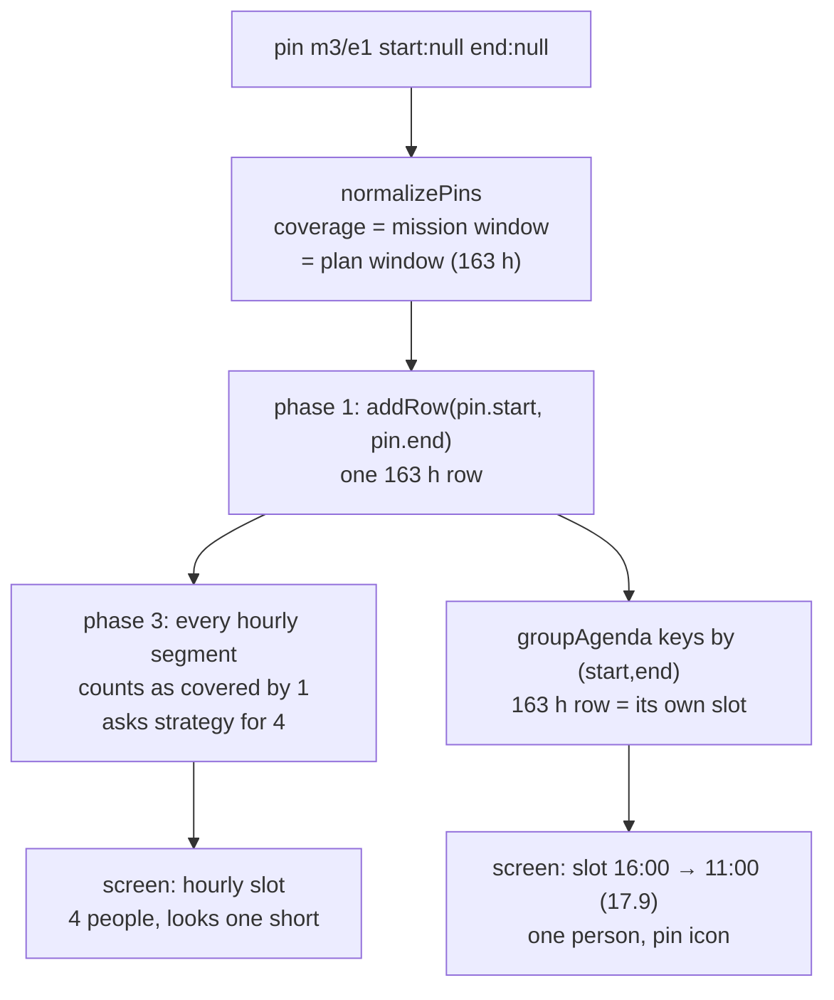
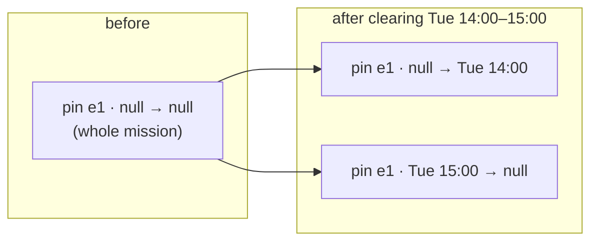

# 01 · A whole-mission pin on a local mission surfaces as one multi-day row

**Kind:** bug · **Status:** planned, not implemented · **Depends on:** nothing

## Symptom

On the schedule screen (phone layout, day of Thursday 10/09), כרמל מוצב shows four people in the
16:00–17:00 slot, and then a *second* slot headed `16:00 → 11:00 (17.9)` containing כרמל מוצב with
one person, pinned. The mission's headcount is five: four rotating people plus one person the
planner assigned from the Missions page as a fixed member ("4+1"). So every hourly slot looks
one short, and there is a 163-hour "shift" at the top of the first day.

The link decodes to: mission `m3`, `type: local`, `count: 5`, and a single pin
`{ missionId: 'm3', employeeId: 'e1', start: null, end: null }` — a whole-mission pin, which is
exactly what `applyMissionAssignees` writes.

## Root cause

`plan()` in `src/lib/planner.js`, phase 1 (*"pins are immovable"*), adds one row per accepted pin
spanning the pin's **entire resolved coverage**, regardless of mission type:

```js
for (const pin of goodPins) {
  addRow(missionById.get(pin.missionId), state.get(pin.employeeId), pin.start, pin.end, true, pin.frozen);
}
```

For a remote mission that is correct — one set of people holds it end to end. For a local
mission the pin coverage is the mission's whole window, so the row is 163 hours long. Nothing
downstream splits it:

- `mergeRows` only ever *joins* rows, and CLAUDE.md records that it was deliberately bounded to
  one slot after "a guard held over eleven slots surfaced as one 88-hour row … and gave the agenda
  a second slot that also began at 22:00 but ended four days later". That fix covered generated
  rows. A whole-mission pin reproduces the same 88-hour-row symptom through a different door.
- `groupAgenda` (`src/lib/agenda.js`) keys slots by `${start}|${end}`, so the long row becomes a
  slot of its own, listed under its start day with a single entry.
- Phase 3 correctly sees the segment as `covered` by the long row and only asks the strategy for
  four more people, which is why the headcount is actually right at every instant — the engine's
  *decision* is fine; its *output shape* is wrong.

Knock-on effects of the same shape:

- `stats.perEmployee` reports the pinned person as 163 h, `stints: 1`, `minGapMinutes: null`.
- The WhatsApp export (`exportText.js`) treats a mission seen once in a day as a "single
  occurrence" and prints it as its own bold block — so the fixed person appears once, at the top
  of day one, and never again.
- Under `rotation`, `slotSpan` charges the run 163 turns. Harmless (a busy person is never a
  candidate) but it shows the row shape leaking into policy.



## Fix

### Engine: emit a local pin as one row per segment it covers

Compute the local segment grid **before** phase 1 (it depends only on the plan window, employee
availability edges and night edges — none of which phases 1 and 2 change), then in phase 1:

- remote mission → unchanged, one row over the whole mission;
- local mission → for each of that mission's segments that intersects `[pin.start, pin.end)`,
  add a pinned row for the intersection.

Concretely, hoist the `baseBoundaries` construction and the per-mission `edges` calculation into
a helper `segmentsOf(mission)` used by both phase 1 and phase 3, so the two can never disagree
about where a segment starts. Pins whose bounds are off-grid (a hand-set mission window is a
grid edge for its own mission already, but a per-shift pin can in principle carry any range)
produce a partial first or last row via the intersection; **do not** add pin bounds to the edge
set, since that would re-segment the mission's unrelated demand and shift the rotation for
plans that carry such pins.

Everything after phase 1 keeps working unchanged:

- `covered` in phase 3 counts rows that span the segment; per-segment rows span it exactly.
- `mergeRows` re-joins a pinned slot that an availability edge split in two, the same way it
  already does for generated rows, and stops at the slot boundary.
- `stats`: the fixed person now has 163 stints of one hour and a `minGapMinutes` of 0 — the
  same reading as everyone else on the rota, which is the honest one.
- `buildTimeline` is already segment-based.
- `groupAgenda`: the person appears inside every hourly slot under כרמל מוצב, with the pin icon,
  so the slot shows five. The phantom multi-day slot disappears.
- The WhatsApp export stops treating the mission as a one-off block.
- `ringKeys` (rotation): `mergedRuns` welds the per-slot intervals back into one run and
  `slotSpan` charges the same 163 turns — no policy change.

### Pin edits: cut a pin instead of deleting it

Once the pinned person is visible in every hourly slot, each of those rows has the swap dropdown
and the clear button. Today both `applySwap` and `applyClearPin` (`src/lib/pins.js`) match the
holder's pin **by coverage** and remove it whole — which was right when the only place to reach
a whole-mission pin was its one long row, but is a trap once clicking "clear" on Tuesday 14:00
silently un-assigns the whole week.

Change both to **cut** the matched pin around `[start, end)`:

| Matched pin covers | Result |
|--------------------|--------|
| exactly `[start, end)` | removed (today's behaviour) |
| more, on one or both sides | replaced by up to two pins: `[range.start, start)` and `[end, range.end)` |

Keep the untouched bound **as written**: a pin that had `start: null` keeps `start: null` on its
"before" remainder, so the remainder still follows the mission window if that is later moved.
Only the cut bound is written as a literal timestamp. `frozen` carries over to the remainders.
The swap then appends the newcomer's per-shift pin as today.



`applyClearPinsForMission` (the warning-driven "remove this pin" button) stays whole-pin: it is
only ever offered for a pin the engine already reported as unusable.

### Missions page

`MissionCard` lists the fixed roster from pins with `start == null && end == null`. After a cut,
the person no longer appears there although most of the week is still theirs. Show them with a
"partial" marker instead of dropping them: any pin on the mission for that employee lists them,
and a chip suffix (`t.assignedPartially`, e.g. "חלקי") says the range was trimmed. Selecting a
partially-assigned person again in the picker re-writes a whole-mission pin (via
`applyMissionAssignees`, which already replaces the null/null pins); deselecting them removes
every pin they hold on the mission. This is the smallest UI that keeps the picker truthful; a
per-range editor is out of scope.

## Files

| File | Change |
|------|--------|
| `src/lib/planner.js` | hoist segment grid; phase 1 splits local pins per segment; `mergeRows` unchanged |
| `src/lib/pins.js` | `applySwap` / `applyClearPin` cut instead of delete; new `cutPin(doc, pin, start, end)` helper, pure and exported |
| `src/pages/MissionsPage.jsx` | roster picker shows partially pinned people |
| `src/strings.js` | `assignedPartially` |
| `tests/planner.pins.test.js` | new cases below |
| `tests/pins.test.js` | cut cases below |
| `tests/e2e.mjs` | assert the regression scenario on screen |
| `CLAUDE.md` | one paragraph under "Working on the scheduler": local pins are emitted per segment; the cut rule |

## Tests

Engine (`tests/planner.pins.test.js`):

1. **Regression fixture** — 16 employees, four local missions with the counts above, hourly
   grid, `rotation`, one null/null pin on the count-5 mission. Assert: no shift on that mission is
   longer than one hour, `staffedAt(m3, t) === 5` for every hour, the pinned person has exactly one
   row per hour and every one has `pinned: true`, `stats` gives them 163 stints.
2. A whole-mission pin on a local mission whose window is off-grid (starts 16:30) yields a
   half-hour first row and a half-hour last row, and every row in between is one slot.
3. A pinned slot torn by an unrelated employee's availability edge merges back into one row
   (mirrors the existing generated-row behaviour).
4. Remote pins are untouched: the existing "whole-mission pins staff a remote mission" case
   still passes unchanged.
5. Rotation output for the fixture is byte-identical before and after (snapshot the JSON of the
   *generated* rows' assignees per slot, since the pinned rows are the thing that changes).

Pin edits (`tests/pins.test.js`):

6. Clearing one hour of a whole-mission pin leaves two pins, the first with `start: null`, the
   second with `end: null`, and the hour uncovered.
7. Clearing the first hour leaves one pin starting at the cut; clearing the last hour leaves one
   pin ending at the cut.
8. Swapping one hour of a whole-mission pin cuts the holder's pin and appends the newcomer's
   per-shift pin; the existing "swapping removes the whole-mission pin" test is rewritten to say
   "cuts", and the two-seat cases stay green.
9. A frozen pin that gets cut produces frozen remainders.
10. `freezeElapsedBeforeEdit` on a document with a whole-mission local pin adds **no** pins for
    the pinned person's elapsed hours (they were already pinned) — guards against the per-segment
    rows being mistaken for generated ones.

Invariants: no change to assertions; the generator already produces null/null pins on local
missions, so the suite covers the new row shape for free.

Browser (`tests/e2e.mjs`): build the fixture through the UI (or paste the link's document via the
debug section), open the schedule, assert `slot-<planStart>` contains five names under כרמל מוצב
and that no `data-testid="slot-…"` spans more than `shiftMinutes`.

## Out of scope

- A per-range editor for pins on the Missions page.
- Coalescing consecutive same-mission events in the iCal export. `exportIcal.js` already slices
  shifts at boundaries, so the fixed person's personal calendar goes from one 163-hour event to
  163 hourly ones. That is consistent with how everyone else's calendar reads today; merging
  back-to-back events of one mission is a separate nicety.
