# 02 · Per-mission shift length, with a night variant

**Kind:** feature · **Status:** implemented · **Depends on:** plan 01 (recommended)

## What is asked

חמ"ל should run in two-hour shifts during the day and one-hour shifts at night. Today there is a
single `shiftMinutes` on the plan, and every local mission rotates on that one grid.

## Design

### Document

Two new nullable mission fields, mirroring `nightCount`:

| Field | Meaning | `null` means |
|-------|---------|--------------|
| `shiftMinutes` | slot length for this mission | the plan's `shiftMinutes` |
| `nightShiftMinutes` | slot length inside the plan's night stretches | same as the mission's day length |

Both `z.number().int().min(5).max(24 * 60).nullable().default(null)`. Remote missions ignore
both (they have no slots). Plan-level `shiftMinutes` stays and becomes the default; its label in
`SettingsBar` gains "ברירת מחדל".

Wire format: positions 7 and 8 of the mission tuple, `0` = not set, trailing unset positions
trimmed — see the reservation table in [README.md](README.md). No version bump. `toPlannerInput`
passes both through (a field missed there is silently inert).

### Engine: one grid per mission

Today `plan()` builds one `baseBoundaries` set — the plan grid anchored at `start`, every
employee's availability edges, every night edge — and every local mission segments itself on it.
That set becomes a *function of the mission*:

```
gridFor(mission):
  if mission has no override (both null)      -> today's shared grid, unchanged
  else if day length == night length          -> anchored at plan start, stepping every shiftMinutes
  else                                        -> per stretch:
       for each night window w:                step nightShiftMinutes from max(planStart, w.start) to min(planEnd, w.end)
       for each day stretch between nights:    step shiftMinutes     from max(planStart, stretch.start) to its end
  + availability edges + night edges + mission start/end   (as today)
```

The first branch is what makes existing links render identically: a mission without an override
is segmented by exactly the code path that segments it today. A golden test pins that (below).

Anchoring each stretch at its own start (or the plan start, when the plan opens mid-stretch) is
what the user asked for: with night 22:00–06:00 and a plan opening Thursday 16:00, חמ"ל at
120/60 gets 16–18, 18–20, 20–22, then 22–23 … 05–06, then 06–08 … A stretch whose length is not a
multiple of the slot leaves one partial slot at its end, the same way today's grid leaves a
partial slot at the plan's end.

```mermaid
gantt
  title חמ"ל grid, plan opens Thu 16:00, night 22:00–06:00
  dateFormat HH:mm
  axisFormat %H:%M
  section day (120)
  16–18 :a1, 16:00, 2h
  18–20 :a2, 18:00, 2h
  20–22 :a3, 20:00, 2h
  section night (60)
  22–23 :b1, 22:00, 1h
  23–00 :b2, 23:00, 1h
```



The demand loop, `countAt`, `nightCount`, pins (per plan 01, split on *this mission's* grid) and
the strategy call are untouched. `demands` are still sorted chronologically then by pool size,
so a two-hour חמ"ל slot starting at 16:00 is filled in the same pass as the hourly 16:00 slots.

### Rows carry their slot

`addRow` stamps every row with `slotStart` and `slotEnd` — the grid slot the segment belongs to
(for a remote row, the mission window). Two consumers stop depending on a single global step:

1. **`mergeRows`** — replace `onShiftBoundary(t)` (modulo arithmetic on the plan step) with "same
   mission, same person, same `pinned`/`frozen`, same `slotStart`, contiguous". Same result on the
   shared grid, correct on any grid.
2. **Turn counting in `strategies.js`** — `ringKeys` currently merges busy intervals into runs and
   charges `slotSpan(run, planStart, step)` per run using `ctx.shiftMinutes`. With per-mission
   grids there is no single step. `occupy` copies `slotStart` (and the `remote` flag) onto the busy
   interval, and `ringKeys` counts **distinct `slotStart` values among intervals that ended before
   `ctx.start`**, plus one per remote interval. Equivalence with today on the shared grid:

   | Situation | `slotSpan` today | distinct `slotStart` |
   |-----------|------------------|----------------------|
   | one slot torn in two by an availability edge | 1 | 1 (same slot) |
   | a run across N consecutive slots | N | N |
   | first half of a slot on A, second half on B | 1 (merged run) | 1 — key on `slotStart` alone, **not** `(mission, slotStart)` |
   | remote hold, then a local slot the moment it ends | 1 + 1 | 1 + 1 |
   | whole-mission local pin (after plan 01) | N | N |

   The third row is why the key must be the bare slot start. `mergedRuns` and `slotSpan` are then
   dead and go; the comment block on `rotation` is rewritten to describe the new count, keeping
   the "a turn is one shift slot, not one unbroken run" argument, which still holds.

`slotStart`/`slotEnd` are also exported on `shifts` — additive, and the agenda can use them.

### Agenda and exports

`groupAgenda` keys a slot by `(start, end)`. With חמ"ל at two hours beside hourly missions, a day
reads 16:00–17:00 (three missions), 16:00–18:00 (חמ"ל), 17:00–18:00 (three missions) … That is
correct and deterministic, it is exactly how a remote block already renders among hourly slots,
and `findNowSlot` keeps picking the shortest containing slot. **Recommendation: ship with this
and look at it on a phone.** If it reads badly, the follow-up is to key by `start` only and
print a mission's own end beside its name when it differs from the gutter's — that change is
contained in `agenda.js`, `AgendaDay.jsx` and `exportText.js`, and needs no engine change. Note
this as an open question in the PR description rather than deciding it blind.

`planText.js` prints `(120/60 דק׳)` after the headcount when either override is set, in the same
"only when it differs" spirit as the `4/6` headcount.

### UI

`MissionCard` (local missions only, next to the two headcount fields): two number inputs,
`t.shiftLengthDay` ("אורך משמרת ביום (דקות)") and `t.shiftLengthNight` ("אורך משמרת בלילה
(דקות)"), `min 5`, `step 5`, placeholder = the inherited value (plan default, or the day length
for the night field), empty string → `null`. `data-testid`: `mission-shift-${id}`,
`mission-night-shift-${id}` via `slotProps.htmlInput`. The row wraps with `gap`, not `spacing`
(CLAUDE.md, wrapping rows). Hidden for remote missions like the night headcount is.

## Files

| File | Change |
|------|--------|
| `src/lib/planSchema.js` | two fields; `toPlannerInput` passes them |
| `src/lib/urlState.js` | positions 7–8; `trimTail` |
| `src/lib/planner.js` | `gridFor(mission)`; `slotStart`/`slotEnd` on rows and busy intervals; `mergeRows` keyed on slot |
| `src/lib/strategies.js` | `ringKeys` counts distinct slot starts; drop `mergedRuns`/`slotSpan` |
| `src/lib/planText.js` | print overrides |
| `src/pages/MissionsPage.jsx`, `src/components/SettingsBar.jsx`, `src/strings.js` | inputs and copy |
| `tests/planner.shiftlength.test.js` (new), `tests/planner.rotation.test.js`, `tests/planner.invariants.test.js`, `tests/urlState.test.js`, `tests/planText.test.js`, `tests/e2e.mjs` | below |
| `CLAUDE.md` | the grid is per mission; the `slotStart` rule replaces the "one global step" assumption |

## Tests

1. **Golden**: build three fixed documents (hourly rota with pins; the eight-hour night-count
   fixture from `planner.nightcount.test.js`; a mixed remote/local one), run `plan()` on the
   current `main`, and commit the JSON output as fixtures. After the change, output for
   documents with no overrides must be byte-identical. This is the test that enforces "a shared
   link renders identically forever" for this refactor, and it stays in the repo.
2. חמ"ל scenario: Thu 16:00 → next Thu 11:00, night 22–06, mission `count: 1`, `120/60`. Assert the
   exact slot list for the first 24 hours and that `staffedAt` is 1 at every instant.
3. Day length only (`120`, night `null`): every slot is two hours, including through the night.
4. Night stretch not a multiple of the night length (night 22:00–06:30, `nightShiftMinutes: 60`)
   leaves one 30-minute slot ending 06:30 and nothing straddles 06:30.
5. Plan opening mid-stretch at 17:00 with `120`: slots 17–19, 19–21, 21–22 (partial), 22–23 …
6. Rotation: a two-hour slot costs one turn — with `rotation`, a person who took a 120-minute
   חמ"ל slot is ranked equal on turns to a person who took one hourly slot (extend
   `planner.rotation.test.js`; keep both existing halves of the 88-hour regression green).
7. Mixed grids in the invariants generator: `shiftMinutes` / `nightShiftMinutes` drawn from
   `{null, 60, 120, 180}` per local mission. All existing properties must hold unchanged;
   additionally assert every local shift lies inside one grid slot of its own mission.
8. `urlState`: a mission with both overrides round-trips; a mission with neither encodes to the
   same blob as before the change (byte equality against a fixture string); an old blob decodes
   with both fields `null`.
9. `planText`: the `(120/60 דק׳)` suffix appears only when set.
10. e2e: set 120/60 on a mission from the Missions page, open the schedule, assert a
    `slot-<16:00>` two hours long exists for it and hourly slots for the others.

## Open questions for the implementer

- Agenda keying (above). Ship `(start, end)` first; decide after seeing it.
- Should the night length on a mission be capped at the night's own duration? The schema max is
  a day; a 600-minute night slot in an eight-hour night simply becomes one partial slot, which is
  harmless. Leave uncapped, document it in the field's help text.

### How they were answered

`(start, end)` keying shipped as recommended, and it was looked at on a 360px phone with חמ"ל at
120/60 beside an hourly ש"ג: the day reads 13:00–14:00 ש"ג, 13:00–15:00 חמ"ל, 14:00–15:00 ש"ג,
15:00–16:00 ש"ג, 15:00–17:00 חמ"ל … Each row carries its own times and its own mission name, the
order is chronological and unambiguous, and nothing overflows. The only wrinkle is that two rows
can both wear the "כעת" chip, which is true and already happens beside a remote block. No change
made. Because a slot id is `slot-<start>` and two slots can now share a start, the elements also
publish `data-slot-end`, which is what `tests/e2e.mjs` uses to tell them apart.

The night length is left uncapped, and `t.shiftLengthNightHelp` says so.
