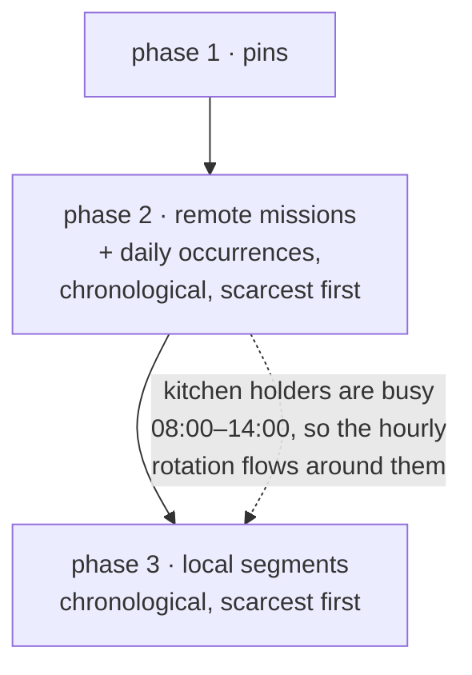

# 03 · Daily missions, held whole, rotated per job

**Kind:** feature · **Status:** planned, not implemented · **Depends on:** plan 02 (recommended, not required)

## What is asked

תורנות מטבח happens **once a day** in a fixed wall-clock window. The same people hold the whole
occurrence, and the job should **rotate per job**: someone who cooked on Monday is the last
person you ask on Tuesday, so across a week nobody does it twice while others have not done it
at all. And nobody should be handed kitchen duty during a slot they are already working.

In the motivating rota the kitchen is modelled as a local mission with `count: 2` over the whole
period, so the engine staffs it every hour around the clock and everyone ends up with 21–22
"kitchen shifts". That is a modelling gap, not a scheduling bug — nothing in the document can
say "once a day, 08:00–14:00".

## Design

### A third mission type: `daily`

```
type: 'daily'
dayStart: minutes past midnight   (like nightStart)
dayEnd:   minutes past midnight   (like nightEnd; dayEnd <= dayStart crosses midnight)
count:    people per occurrence
start/end: first/last instant the mission exists, as for every mission (null = plan window)
```

`nightCount`, `shiftMinutes` and `nightShiftMinutes` are ignored on a daily mission, exactly as
`nightCount` is ignored on a remote one. Both `dayStart`/`dayEnd` are nullable so a half-typed
row never fails validation (CLAUDE.md); a daily mission missing either bound simply has no
occurrences, and the Missions page shows a hint instead of the engine warning.

Wire: type code `2`, positions 9–10 of the mission tuple, `null` = unset (`0` is midnight). See
the reservation table in [README.md](README.md).

### Occurrences are resolved in the adapter, never in the engine

`planSchema.js` gains `dailyOccurrences(doc, mission)` next to `nightWindows(doc)`: walk each
calendar day from the day before `doc.start` to the day after `doc.end`, build
`[atMinute(day, dayStart), atMinute(day or next day, dayEnd))`, clamp to the mission window and the
plan window, drop anything empty. Stepped with `Date`, so DST keeps the kitchen at 08:00 on both
sides of the change. `toPlannerInput` passes `occurrences: [{start, end}]` on the mission.

This has the same timezone trade as `nightWindows` and for the same reason: "08:00" is not a
moment until a timezone says so, and the engine may not consult one. A plan opened several
timezones away places the kitchen by the reader's clock. For this rota that is the reading people
want, and the CLAUDE.md paragraph on night windows should be extended to say the two fields
behave the same way.

### Engine: an occurrence is a remote hold with a narrower window



Phase 2 already does everything an occurrence needs: candidates must be available and free for
the whole window, the strategy ranks them with `kind: 'remote'`, the chosen people get one row
spanning it, and `UNDERSTAFFED` is raised with the window if too few are free. The change is to
feed phase 2 a list of *holds* — every remote mission as one hold, every occurrence of every
daily mission as one hold — sorted by the existing key (start, pool size, length, id). Rows keep
`missionId` = the daily mission's id, `type: 'daily'`.

Placing occurrences in phase 2 rather than interleaving them with the hourly segments is a
deliberate choice: the once-a-day job is the scarce claim (six hours of one person, needed free
end to end), the hourly slots are the plentiful ones, and "scarcest first" is already the rule
this phase runs on. It also delivers "not when I'm already on another mission" by construction:
whoever holds the kitchen is busy for it before any hourly slot in that window is filled, so the
rotation routes around them rather than the other way round. The cost is that, under `balanced`,
the occurrence is picked before hourly load exists to balance against; the per-job key below is
what the user asked to balance, so that is acceptable. If a rota ever needs the opposite
priority, that is a strategy concern, not an engine one.

`occupy` marks the busy interval `hold: true` (rename of the existing `remote` flag, since the
ring charges any hold exactly one turn — "one claim taken once").

### Per-job rotation is a strategy key, not an engine rule

Both strategies get `kind: 'daily'` in `ctx` and rank **turns on this mission first**:

| Strategy | `kind: 'daily'` order |
|----------|------------------------|
| `rotation` | fewest turns on this mission → earliest end of last turn → fewest turns overall → `ringIndex` |
| `balanced` | fewest minutes on this mission → fewest minutes overall → earliest `lastEnd` → `seq` |

`missionMinutes` already exists in the state; `rotation` needs `missionTurns`, which with plan 02
is "distinct `slotStart` among this mission's intervals" and without it is a `Map` bumped in
`occupy` per hold (one per occurrence). Either way it is measured as of `ctx.start`, like the
other ring keys.

With 15 rotating people, two seats and seven days, the per-job key alone guarantees at most one
kitchen turn each; on the eighth day the ring starts over with the longest-rested cook. This
scope is the daily missions only. A per-mission variety key for the *hourly* rotation (so ש"ג
and כרמל also alternate people) is a reasonable follow-up but not what was asked; note it in the
PR and leave `rotation`'s local ordering alone.

### Pins on a daily mission

| Pin | Meaning |
|-----|---------|
| `start: null, end: null` | every occurrence — a fixed cook |
| a range | every occurrence the range **touches**, taken whole |

Coverage snaps to whole occurrences, the remote rule ("a pin means the whole hold, however it was
written"), because a half-occurrence pin would leave the other half short. Staleness follows the
*local* rule — `isOutOfPeriod` uses the pin's written range when it has one — so a frozen pin for
last Tuesday's kitchen is residue that `clearStalePins` can collect, unlike a remote pin whose
range is ignored. `resolvePinWindow` is unchanged; `normalizePins` gains a branch that expands a
daily pin into one claimant per touched occurrence, seat-counted per occurrence. A swap on the
schedule writes the occurrence's `start`/`end`, which round-trips through the snap unchanged.
`freezeElapsedBeforeEdit` freezes an elapsed occurrence as a per-occurrence pin for free.

### Agenda and exports

An occurrence is a `(start, end)` slot like a remote block today. `exportText.js` already prints a
mission that appears once in a day as its own bold block, which is exactly the WhatsApp line
people expect for the kitchen. `MissionChip`/`MissionGroup` colour daily like remote
(`secondary`), or a third colour if the theme has one to spare — the point is that it does not
read as an hourly rotation. `stats.stints` counts one per occurrence.

### UI

`MissionCard`:

- `ToggleButtonGroup` gains `daily` (`t.typeDaily`, "יומית"), `data-testid="type-daily-${id}"`.
- When daily: two time inputs `t.dailyFrom` / `t.dailyTo` (reuse the minute-of-day input the
  night window uses in `SettingsBar`), `data-testid="mission-day-start-${id}"` / `…-end-…`;
  the headcount label reads `t.headcountPerOccurrence` ("כמה אנשים בכל פעם"); night headcount
  and per-mission shift length are hidden; the mission window fields stay (first/last day).
- A hint `t.dailyIncomplete` when either bound is missing.
- The fixed-roster picker works as today (null/null pins).

`planText.js` prints `(יומית 08:00–14:00, 2)`.

## Files

| File | Change |
|------|--------|
| `src/lib/planSchema.js` | enum + two fields; `dailyOccurrences`; `toPlannerInput` |
| `src/lib/urlState.js` | type code 2; positions 9–10 |
| `src/lib/planner.js` | holds list in phase 2; daily pin expansion in `normalizePins`; `hold` flag; `isOutOfPeriod` branch |
| `src/lib/strategies.js` | `kind: 'daily'` ordering in both strategies; `missionTurns` |
| `src/lib/planText.js`, `src/lib/exportText.js` | daily rendering |
| `src/components/AgendaDay.jsx`, `src/pages/MissionsPage.jsx`, `src/strings.js` | type toggle, time inputs, colour |
| tests: `tests/planner.daily.test.js` (new), `tests/planner.invariants.test.js`, `tests/urlState.test.js`, `tests/pins.test.js`, `tests/planText.test.js`, `tests/e2e.mjs` | below |
| `CLAUDE.md` | daily missions paragraph: adapter-resolved occurrences, snap rule, staleness rule |

## Tests

1. `dailyOccurrences`: one per calendar day inside the plan; a window crossing midnight; a
   window clamped by the mission's own `start`; the day before the plan contributes an occurrence
   only if it overlaps the plan; equal bounds give none; DST week keeps 08:00 local.
2. Same people hold an occurrence end to end (mirror the remote invariant, asserting
   `start`/`end` equal the occurrence).
3. **Per job**: 15 people, `count: 2`, seven days, `rotation` → no employee appears twice on the
   kitchen; under `balanced` the same holds.
4. Not double-booked: a person on a two-hour local slot overlapping the occurrence is not picked
   for it, and the hourly slot inside the occurrence never picks a cook (invariants cover the
   first; add an explicit case for the second so the phase order is pinned).
5. The ring charges a six-hour occurrence as one turn (extend `planner.rotation.test.js`).
6. Pins: null/null pin puts the person on every occurrence; a one-day pin covers that occurrence
   only; a half-occurrence pin snaps to the whole occurrence with no warning; a pin for a day the
   mission does not run is `PIN_UNAVAILABLE`; a frozen per-occurrence pin from before the period
   is counted in `PIN_OUT_OF_PERIOD` and removed by `clearStalePins`.
7. Understaffed occurrence raises one `UNDERSTAFFED` with the occurrence window.
8. Invariants generator: `type` drawn from `{local, remote, daily}`, `dayStart`/`dayEnd` from a
   few wall-clock values. All existing properties unchanged; add "every daily shift equals one
   resolved occurrence".
9. `urlState`: daily mission round-trips; a document with no daily mission encodes byte-identical
   to before; an old blob still decodes.
10. e2e: create a daily mission from the UI, open the schedule, assert one slot per day for it and
    that the WhatsApp text has one bold kitchen line per day.

## Out of scope

- Occurrences more than once a day, or on selected weekdays only. The field pair generalises to
  a list later without a version bump (append a weekday mask at position 11).
- Per-mission variety in the hourly rotation (see above).
- Editing pin ranges on the Missions page (plan 01 lists the same limitation).
