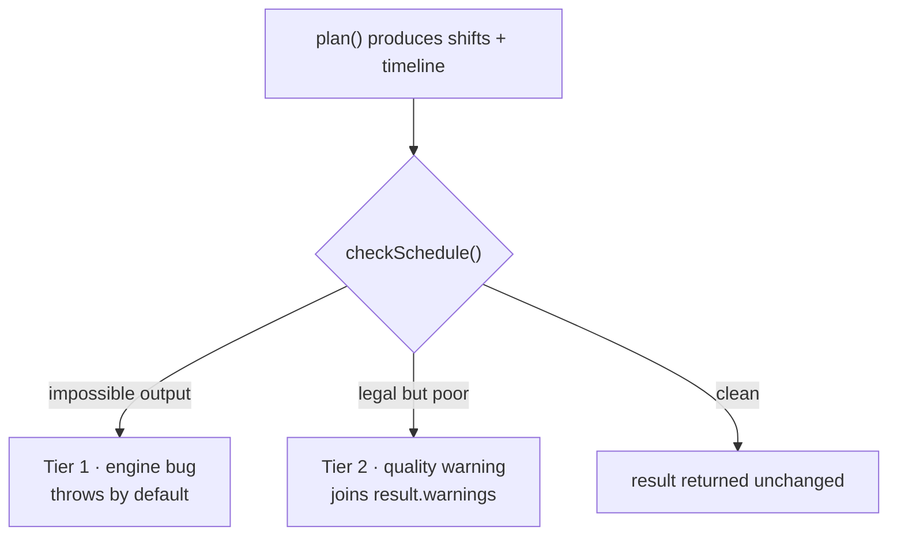

# 04 · Constraints that catch a bad schedule before the user does

**Kind:** hardening · **Status:** planned, not implemented · **Depends on:** plan 01 (hard — see *Sequencing*)

## Why

Two schedule-shape bugs have now shipped to a real rota:

| Bug | Shape | Caught by a test? |
|-----|-------|-------------------|
| 88-hour block (PR #27) | a local row welded across 11 consecutive slots | no |
| 163-hour row (plan 01) | a whole-mission pin emitted as one row on a local mission | no |

Both are the same class: **a row that is longer than any shift anyone can work.** Neither was
caught, and in both cases the person who found it was the user, reading the agenda on a phone.

`tests/planner.invariants.test.js` is described in CLAUDE.md as "the real safety net" — ~1600
generated plans asserting no double-booking, no overstaffing, availability respected, determinism.
It missed both, for two reasons worth stating plainly:

1. **There is no row-length assertion in it at all.** It checks who and how many, never how long.
2. **Its generator produces no pins.** `planArb` has no `pins` field and `build()` never adds one,
   so across every generated plan the pin path — the path both bugs ran through — is untested.

A generated-input suite only ever covers what the generator thinks to build. The fix is to stop
relying on that alone and **check the engine's own output, on every plan, including the user's**.

## Two tiers, and the line between them



The distinction is **not** severity, it is *whose fault it is*:

- **Tier 1 — the output is impossible.** No input can justify it. A person in two places at once is
  not a scheduling trade-off, it is the engine contradicting itself. These are bugs in
  `planner.js`, and they should be loud.
- **Tier 2 — the output is legal but poor.** Somebody works two hours straight because there were
  more seats than rested people. That is a real constraint of the roster, not a defect, so it
  informs rather than blocks.

This is a different axis from the existing rule in CLAUDE.md ("infeasible input warns, structurally
invalid input throws"), which is about **inputs**. Tier 1 is about **outputs** and is new: today
the engine never checks its own work.

## Tier 1 — impossible output

| Check | Rule | Exemptions | Would have caught |
|-------|------|------------|-------------------|
| `DOUBLE_BOOKED` | one person appears twice at one instant | none | — |
| `ROW_EXCEEDS_SLOT` | a **local** row is longer than that mission's slot | remote, and `daily` after plan 03 | **both shipped bugs** |
| `OVERSTAFFED` | rows on a mission at an instant exceed its headcount there | none | — |
| `OUTSIDE_MISSION_WINDOW` | a row falls outside the mission's own window | none — geometry never yields | — |
| `OUTSIDE_AVAILABILITY` | a row falls outside the person's window | **pinned rows** | — |
| `REMOTE_NOT_WHOLE` | a remote row does not span its mission exactly | none | — |
| `TIMELINE_GAP` | `timeline` does not tile `[start, end)` exactly | none | — |

`OUTSIDE_AVAILABILITY` **must** exempt pinned rows, and this is the one place the checker can
brick a legitimate document if it gets it wrong. A manual assignment outranks a stale availability
window by design — `normalizePins` step 3 makes availability informational and raises
`PIN_AVAILABILITY_OVERRIDDEN` instead of dropping the pin. The existing property test already
carries exactly this carve-out (`if (!s.pinned)`); copy it verbatim rather than re-deriving it.

`ROW_EXCEEDS_SLOT` is the load-bearing one. It is worth stating why it is safe to make fatal:
a local mission rotates every slot **by definition** — that is what distinguishes it from remote —
so a row spanning two slots means either the merge welded shifts that should be separate or a pin
was emitted whole. There is no third reading, and no legitimate document produces one.

### It is nearly free, and the timeline already does the work

`buildTimeline` already breaks at every shift edge and lists `onDuty` per segment, and it is
already computed for every plan. Both `DOUBLE_BOOKED` and `OVERSTAFFED` fall out of one linear pass
over it — no pairwise comparison:

```js
for (const seg of timeline) {
  const seen = new Map();
  for (const o of seg.onDuty) {
    if (seen.has(o.employeeId)) violation(DOUBLE_BOOKED, o.employeeId, seen.get(o.employeeId), o.missionId, seg);
    else seen.set(o.employeeId, o.missionId);
  }
}
```

This matters: the schedule recomputes on **every render**, and the motivating rota is 1305 shifts.
A naive pairwise overlap scan is 1.7M comparisons per keystroke; the pass above is one visit per
on-duty entry. `ROW_EXCEEDS_SLOT` and the window checks are one pass over `shifts`. Everything is
O(n), and nothing new is computed that the engine was not computing already.

Verified against a fabricated bad timeline: the pass catches both a person on two different
missions at once and a person filling two seats of the *same* mission, and is silent on a clean
segment. The second case matters — it is a distinct bug that a naive "are these two missions
different" test would wave through.

### Descriptive messages, without breaking the purity rule

The user asked for descriptive errors, and `planner.js` may not import `strings.js` (CLAUDE.md:
the engine imports nothing outside `strategies.js`). So the two audiences are served separately:

- **The throw** carries a developer-facing English message, built from ids and ISO instants:
  `Engine invariant DOUBLE_BOOKED: employee e2 is on m1 and m4 simultaneously at 2026-09-11T11:00:00.000Z. This is a bug in the scheduler.`
  Include the violated rule name, the people and missions by id, and the instant — enough to write
  a failing test from the message alone.
- **The warning object** carries structured fields (`code`, `employeeId`, `missionId`,
  `otherMissionId`, `start`, `end`) and the UI renders Hebrew from `strings.js`, naming people and
  missions rather than ids.

## Tier 2 — legal but poor

| Warning | Rule | Fires on the real rota? |
|---------|------|-------------------------|
| `SAME_MISSION_CONSECUTIVE` | consecutive slots on the *same* mission | **no — 0 occurrences** |
| `NO_REST_BETWEEN_SHIFTS` | any two shifts with a zero gap | **yes — 162 pairs, every person** |
| `LONG_UNBROKEN_RUN` | ≥ 3 slots on duty without a break | no — worst is 2 slots |

### Tier 2 must skip pinned rows

**This is not optional, and it was invisible until plan 01 landed.** Before 01 a whole-mission pin
was one long row, so it produced no adjacent pairs at all and no run to measure. After 01 the same
assignment is one row per slot — correctly — and the person the user deliberately pinned to a
mission for the whole week now reads as 162 same-mission back-to-back pairs and a 163-hour unbroken
run. Every figure in the table above flips on that one person:

| Measured after plan 01 | All rows | Excluding pinned rows |
|------------------------|----------|-----------------------|
| same-mission back-to-back pairs | 162 | **0** |
| longest unbroken run | 163 h | **2 h** |

The right-hand column is the signal; the left is one deliberate decision counted 162 times. So
**every Tier 2 rule ignores pinned rows**, and a run is broken by a pinned row rather than extended
through it. A person the user assigned by hand is not the engine stranding anybody, and a warning
that fires on the user's own explicit choice teaches them to ignore the warnings.

Tier 1 is the opposite and keeps counting pinned rows: a pinned person double-booked or seated
outside the mission window is still impossible output, whoever asked for it.

**One honest note about the constraint as specified.** "Back to back on the same mission should be
rare" is already satisfied: on the motivating rota it happens **zero** times out of 162 adjacent
pairs. That is not luck — under `rotation` the person who just came off is the least rested and
sorts last, so the strategy actively avoids it. What *is* happening on that plan is cross-mission
adjacency: every one of the 16 people has a minimum gap of zero, working an hour on one mission and
then an hour on another. If the thing being noticed on screen is people never getting a break, the
warning that surfaces it is `NO_REST_BETWEEN_SHIFTS`, not the same-mission one.

So build both, with the same-mission case as the stricter sub-case that carries a sharper message.
Report them **aggregated** (a count plus the worst offenders), never one alert per pair — 162
alerts is the same wall-of-noise failure that `PIN_OUT_OF_PERIOD` is deliberately counted to avoid.

Thresholds are grounded in measurement on the real rota rather than picked: at `≥ 3 slots`,
`LONG_UNBROKEN_RUN` is silent on a plan whose worst genuine (unpinned) run is 2 slots, and would have shouted
at the 88-hour block. Make it a plan-level field only if a second rota disagrees; a constant with a
comment citing these numbers is enough for now.

## The one place a fatal error must not be fatal

Both call sites already catch, so nothing white-screens:

| Caller | On throw today |
|--------|----------------|
| `SchedulePage`'s `useSchedule` | caught, `{ error: e.message }` rendered in an `Alert` |
| `freezeElapsedBeforeEdit` (`pins.js`) | caught, returns `next` unchanged |

But the schedule screen's error branch skips the entire `result && (…)` block — **including
`ShareBar`**. So an engine bug would remove copy-link, CSV and WhatsApp export at precisely the
moment the user needs to save the rota and report it. The plan document lives only in the URL and
is their only copy; a check meant to protect them must never be the thing that strands them.

Three changes make the fatal path safe:

1. **`plan()` takes `onInvariantViolation: 'throw' | 'report'`, defaulting to `'throw'`.** Tests,
   CI and any script get the hard, descriptive failure that was asked for. The schedule screen —
   and only it — passes `'report'`, which puts the violations in `warnings` under
   `WARN.ENGINE_BUG` and still returns the schedule.
2. **Render the violation as `severity="error"` with its own copy**, distinct from the existing
   `severity="info"` messages. "Add an employee to plan" and "the scheduler produced an impossible
   schedule" are currently the same colour and shape.
3. **Keep `ShareBar` mounted on the error branch**, so exporting and copying the link still work
   while the banner is up.

The default stays strict, so the literal reading of "impossible, fatal, descriptive" holds
everywhere it costs nothing. The single screen where strictness would cost someone their rota opts
out visibly, showing exactly what is wrong rather than hiding it.

Note also that `freezeElapsedBeforeEdit` swallowing the throw means a violation silently stops
history from being frozen. That is acceptable degradation, but it should call `plan()` in
`'report'` mode too, so a Tier-1 violation does not quietly change freezing behaviour as a side
effect.

## Sequencing — 04 depends on 01

**`ROW_EXCEEDS_SLOT` fails on `main` today**, on the user's own plan: the 163-hour pinned row is a
violation. So 04 cannot land before 01 without immediately throwing on a real shared link.

Recommended order becomes **01 → 04 → 02 → 03**: fix the bug, lock it in, then build the two
features against a checker that is already watching. 02 and 03 each extend Tier 1 by one line:

- **02** makes the slot length per-mission, so `ROW_EXCEEDS_SLOT` measures against that mission's
  own grid rather than the plan's `shiftMinutes`. With rows carrying `slotStart`/`slotEnd` (plan 02),
  the check becomes "a local row lies inside one slot" — stricter and simpler than a length compare.
- **03** adds `daily` missions, which legitimately run longer than a slot and join the exemption
  list beside remote.

If 04 is built before 02, write the check against the plan-level `shiftMinutes` and leave a comment
pointing at 02; it is a one-line change afterwards.

## Files

| File | Change |
|------|--------|
| `src/lib/invariants.js` (new) | `checkSchedule(result, input)` → violation list; pure, no imports outside `planner.js`'s own rules |
| `src/lib/planner.js` | call it at the end of `plan()`; `onInvariantViolation` option; new `WARN` codes |
| `src/pages/SchedulePage.jsx` | `'report'` mode, `severity="error"` banner, keep `ShareBar` mounted on the error branch |
| `src/lib/pins.js` | `freezeElapsedBeforeEdit` calls `plan()` in `'report'` mode |
| `src/strings.js` | Hebrew copy for each violation and each quality warning |
| `tests/planner.invariants.test.js` | **add pins to the generator**; assert Tier 1 holds on every generated plan |
| `tests/invariants.test.js` (new) | the checker's own unit tests, below |
| `CLAUDE.md` | a section on the output-check tier and why it is separate from input validation |

## Tests

The checker is the one module that must be tested against **deliberately broken input**, since the
engine will not produce a violation on request. Build bad `result` objects by hand and assert the
checker catches each:

1. One person on two missions at one instant → `DOUBLE_BOOKED`, message names both missions and the
   instant.
2. One person filling two seats of the *same* mission → `DOUBLE_BOOKED` (the case a "different
   mission" test would miss).
3. A local row spanning two slots → `ROW_EXCEEDS_SLOT`. A local row exactly one slot long → clean.
   A remote row spanning the whole plan → clean.
4. A row outside the person's availability with `pinned: true` → clean; the same row with
   `pinned: false` → `OUTSIDE_AVAILABILITY`. This pair is the regression guard for the carve-out.
5. Headcount+1 rows at one instant → `OVERSTAFFED`; at a night instant, measured against
   `nightCount`, not `count`.
6. A timeline with a gap, and one with an overlap → `TIMELINE_GAP`.
7. `'report'` mode returns the schedule with `WARN.ENGINE_BUG` in `warnings` and does not throw;
   `'throw'` mode throws with the same information in the message.
8. **Regression fixture**: the motivating rota's document (16 people, four missions, the null-range
   pin) is clean under 01 + 04, and its pre-01 output trips exactly one `ROW_EXCEEDS_SLOT`.
9. Quality tier: a rota engineered so one person takes three consecutive slots →
   `LONG_UNBROKEN_RUN` once, aggregated, not three times. A rota with same-mission adjacency →
   `SAME_MISSION_CONSECUTIVE` with a count.
9a. **Pinned exemption**: the motivating rota, whose whole-mission pin now spans 163 hourly rows,
    produces **no** Tier 2 warning for that person — and the same rota with the pin removed and the
    engine forced into the same shape does. This is the regression guard for the section above, and
    it must fail if the exemption is dropped.
10. Performance: the 1305-shift fixture runs the checker in well under a frame, asserted as a
    bound on work done (entries visited), not wall-clock — the engine must stay deterministic and a
    timing assertion would be flaky in CI.

Property suite (`planner.invariants.test.js`), the change that closes the actual gap:

11. **Add pins to `planArb`** — whole-mission and per-shift, some frozen, some contested, some
    naming people who are unavailable. Every existing property must still hold.
12. Assert `checkSchedule` returns no Tier-1 violation across every generated plan. This is the
    assertion whose absence let both bugs through, and it subsumes several hand-written checks
    already in the file.

## Measured evidence

All figures from the motivating rota (16 people, four local missions, hourly, `rotation`,
1305 shifts) run through the engine on `main`:

| Check | Before plan 01 | After plan 01 (what this plan will see) |
|-------|----------------|------------------------------------------|
| `ROW_EXCEEDS_SLOT` | **1 violation** — the reported 163 h row, nothing else | **0** |
| `DOUBLE_BOOKED` | 0 | 0 |
| `SAME_MISSION_CONSECUTIVE` | 0 of 162 adjacent pairs | 0 — **once pinned rows are skipped**; 162 if they are not |
| `NO_REST_BETWEEN_SHIFTS` | 162 pairs — every person has a zero minimum gap | 162, unchanged |
| `LONG_UNBROKEN_RUN` (≥3 slots) | 0 — worst genuine run is 2 slots | 0 — **once pinned rows are skipped**; 163 h if they are not |

Both columns were produced by running the engine on the decoded rota, the second after plan 01 was
merged. The right-hand column is the one to design against, since 04 lands after 01.

One true positive, zero false positives, on a real 1305-shift plan. That is the case for making
Tier 1 fatal.

## Out of scope

- Repairing a violation automatically. The checker reports; it never edits the schedule. An engine
  that patches its own output is an engine whose bugs are invisible again.
- Enforcing fairness (`spreadMinutes`) as a constraint. Under `rotation` a large spread is the
  documented, expected outcome, so a threshold there would fire on correct plans.
- Reporting Tier-2 warnings in the exports. They describe the plan's quality, not the roster, and
  the WhatsApp message is read by the guards, not the person building the rota.
