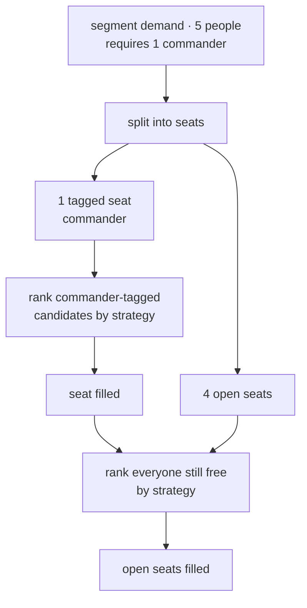
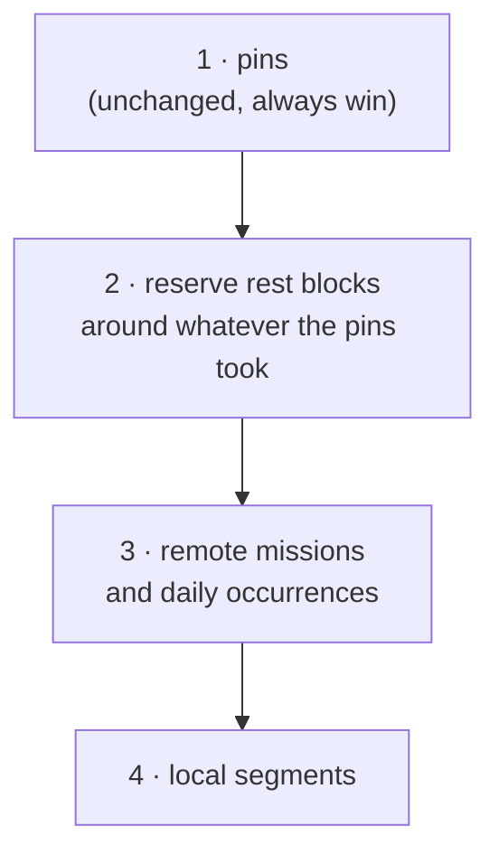

# 05 · Qualifications: tagged people, tagged seats, and enforced rest

**Kind:** feature · **Status:** planned, not implemented · **Depends on:** plan 03 (for the stated kitchen case), interacts with 02 and 04

## What is asked

Four things, and they are four different mechanisms wearing one name:

1. **Tag people with qualifications** — driver, commander, medic.
2. **A mission requires a qualification**: every shift on it must include a qualified person.
3. **A mission excludes a qualification**: commanders never do kitchen duty, because they already
   carry enough.
4. **A qualification carries a rest rule**: a driver needs six hours of sleep at night.

Only (3) is a filter on individuals, which is the only shape the engine's candidate pipeline can
express today. (2) is a constraint on the *set* of people chosen for a slot, (4) is a constraint
across a *whole night*, and both need new machinery. Treating all four as "just another filter" is
the way to get this wrong.

## The document

A tag is a first-class, plan-level record referenced by id — the same shape as employees and
missions, and for the same reasons: it needs a Hebrew display name the user can rename without
breaking references, and it carries policy of its own.

```
tag:      { id, name, minNightRestMinutes: number | null }
employee: { …, tags: string[] }                       // tag ids
mission:  { …, requires: [{ tag, count }], excludes: string[] }
plan:     { …, tags: Tag[] }
```

| Field | Meaning | Default |
|-------|---------|---------|
| `tag.minNightRestMinutes` | continuous off-duty minutes required inside each night stretch | `null` — no rest rule |
| `employee.tags` | qualifications this person holds | `[]` |
| `mission.requires` | seats that must be filled by a holder of each tag | `[]` |
| `mission.excludes` | tags barred from this mission entirely | `[]` |

Wire format, continuing the reservation table in [README.md](README.md) — appending only, so no
`SCHEMA_VERSION` bump:

| Tuple | Position | Field | Unset |
|-------|----------|-------|-------|
| employee | 4 | `tags` | `[]`, trimmed when empty |
| mission | 11 | `requires`, as flat `[tagId, count, …]` pairs | `[]`, trimmed |
| mission | 12 | `excludes` | `[]`, trimmed |
| plan | new key `tg` | the tag list | `[]` |

`tags` is a new plan-level field with a `.default([])`, so every link written before it existed
still parses and keeps its old meaning — the worked example is `strategy`. Pass all of it through
`toPlannerInput`, which is the only route into the engine; a field missed there is silently inert.

Deleting a tag must strip it from every employee and mission, the same way `prunePins` strips
references to a deleted employee or mission. Put it beside that function and call it from the same
place, or the URL carries dangling tag ids forever.

## Requiring a tag is a constraint on the set, not on a person

Today `planner.js` filters candidates by availability, bookings, windows and pins, hands the
survivors to a strategy, and takes `candidates.slice(0, need)`. "At least one of these five must be
a commander" cannot be expressed as a filter on any individual candidate, and it must not become
one: CLAUDE.md is explicit that *who* gets a slot is the strategy's decision and that a new strategy
must never require a change in `planner.js`.

So the demand is **split into seats** before ranking, and the strategy still only ever ranks:



Tagged seats are filled first, **scarcest tag first** — the same most-constrained-first principle the
engine already applies to remote missions and to concurrent local demands. A tagged person is still
an ordinary candidate for an open seat afterwards; holding a tag is a qualification, not a job.

### Two rules that are easy to miss

**One person fills one seat.** A mission requiring one commander *and* one driver needs two distinct
people, even if somebody holds both tags. The requirement counts seats, not satisfied predicates.

**Scarcest-first alone is not exact, and the near-miss is the common case.** Suppose a mission needs
two people, one commander and one driver:

| Person | Tags |
|--------|------|
| Alice | commander, driver |
| Bob | commander |

Fill the commander seat first and the strategy prefers Alice, so Alice takes it — and the driver
seat has nobody left, reporting a shortage that does not exist. Alice as driver and Bob as commander
staffs it perfectly. Ordering by scarcity fixes exactly this case (the driver pool is `{Alice}`,
size 1, so it is filled first), which is why the ordering is not a nicety.

Scarcity ordering is still a heuristic once three or more tags have equal-sized pools. Make it exact
cheaply: when picking a candidate for a tagged seat, **skip a candidate whose removal would leave
the remaining tag requirements unsatisfiable**, tested by a small bipartite feasibility check over
the remaining seats and candidates. Real numbers are tiny — at most a handful of tags against a
handful of seats — so an augmenting-path check costs nothing and removes the whole class of
phantom shortages. Ties break on the strategy's order, then on employee id, so the result stays
deterministic.

## Excluding a tag is a plain filter

`excludes` is the one piece that *is* ordinary eligibility, and it drops straight into the candidate
filters in both the remote phase and the local-segment phase. "Commanders never do kitchen duty" is
`excludes: ['commander']` on the kitchen mission — which, per plan 03, is a `daily` mission, so 05
needs 03 for the stated use case to work as described.

A pin still wins. Pinning a commander to kitchen duty is a statement about what actually happened,
and CLAUDE.md is unambiguous that a manual assignment is an input fact rather than a suggestion the
engine may veto. So an excluded pin is honoured with an informational `PIN_EXCLUDED_TAG`, exactly
as `PIN_AVAILABILITY_OVERRIDDEN` already handles a stale availability window.

A mission that both requires and excludes the same tag can never be staffed. Tempting to throw, but
do not: the schema must tolerate a document mid-edit, and a user assembling the two lists will pass
through that state. Warn, and have the Missions page grey the tag out in the second picker.

## Rest is reserved, not merely checked

"Six hours of sleep at night" is unlike every constraint the engine has. All the others are local —
*is this person free for this segment?* — and can be answered while filling that segment. Whether a
driver may work 23:00–00:00 depends on what else they work at 03:00, which the chronological fill
has not decided yet. Greedy filling cannot enforce it without lookahead.

The way out is to stop treating rest as a check and treat it as **time that is already taken**.
Before any mission competes for people, each rest-constrained person has a rest block reserved
inside each night; from then on the ordinary machinery does the work, because they are simply not
free then.



Reserving **after** pins is what keeps the two rules consistent: a pin outranks everything, so the
rest block is placed in whatever the night still has free, and a driver pinned across the whole
night gets a warning rather than a silently broken rule.

**Which six hours.** With the default night of 22:00–06:00 there are three hour-aligned six-hour
blocks. Pick deterministically and *spread* people across the choices — round-robin by the
employee's position in the document, the same ordering `rotation`'s ring index already uses — so
drivers do not all sleep at once and leave the night bare.

**Reserved time is not time on duty.** It must not reach `minutes`, `stints`, `lastEnd` or the
rotation ring's turn count, or a driver's sleep would make them look like the busiest person on the
roster and push them to the back of the ring. `st.busy` cannot be reused: `isFree` reads it, but so
does `occupy`'s accounting and `mergedRuns`. Add a separate `st.reserved` list that **`isFree`
checks and nothing else reads**. `occupy` continues to append only to `st.busy`.

**Rest edges join the segment grid**, beside the night edges that plan 02 already adds, so no
segment straddles the start or end of a rest block and has to pick a side.

The honest cost: reserving sleep up front can make a night unstaffable that would otherwise have
been staffable. That is the correct answer rather than a regression — if the night cannot be covered
while drivers sleep, that is a real shortage and belongs on screen. A driver whose rest cannot be
placed at all gets `REST_UNSATISFIED` naming the person and the night.

## "Without enough commanders, fail"

Not a throw. CLAUDE.md draws the line at structural invalidity, and *not enough qualified people* is
the definition of infeasible input, which returns warnings plus a partial plan — "someone mid-edit
needs to see what is short, not a stack trace." A missing commander is the user's roster being
short, not the engine malfunctioning.

But it is categorically worse than an ordinary shortage, and the UI should say so. A shift with four
of five guards is short-handed; a shift with no commander is not a lawful shift at all. So:

| Code | Meaning | Rendering |
|------|---------|-----------|
| `MISSING_REQUIRED_TAG` | a tagged seat could not be filled | `severity="error"`, named per shift with the tag |
| `UNDERSTAFFED` | an open seat could not be filled | unchanged, `warning` |
| `REST_UNSATISFIED` | no rest block could be placed for a person | `severity="error"` |
| `PIN_EXCLUDED_TAG` | a pin puts an excluded tag on a mission | informational |
| `TAG_REQUIRED_AND_EXCLUDED` | contradictory mission configuration | `warning` |

Aggregate `MISSING_REQUIRED_TAG` per mission and tag rather than emitting one per segment. A
week-long rota with no commanders would otherwise produce 163 identical alerts — the wall-of-noise
failure `PIN_OUT_OF_PERIOD` is deliberately counted to avoid.

## UI

- **A tag manager**, on the Employees page above the list: add, rename, delete, and set night rest
  minutes per tag. Tags are a property of people, so this is where someone looks for them. Deleting
  prompts, and says how many people and missions reference the tag.
- **Employees list**: a chip multi-select per row. The row already wraps on a phone, so space it
  with `gap` via `useFlexGap`, never `Stack`'s margin-based `spacing`, or the chips land on top of
  the row below.
- **Missions page**: a "requires" editor (tag plus a count) and an "excludes" multi-select, both
  hidden until at least one tag exists so an unused feature costs no screen space.
- **Agenda**: mark the person filling a tagged seat, so a filled commander seat is visible at a
  glance, and render `MISSING_REQUIRED_TAG` as an error on the slot rather than a page-level alert.
- All copy in `src/strings.js`, and every new input needs `slotProps={{ htmlInput: … }}` so its
  `data-testid` survives into `tests/e2e.mjs`.

## Interaction with the other plans

| Plan | Interaction |
|------|-------------|
| 01 | a pinned commander occupies the commander seat in each per-segment row; no extra work |
| 02 | rest-block edges join the per-mission grid beside the night edges |
| 03 | `excludes` on the daily kitchen mission is the literal stated requirement — **05 needs 03** |
| 04 | two new Tier-1 invariants, and one deliberate non-invariant |

For plan 04 specifically:

- **New Tier 1**: a seat the engine recorded as tag-filled is held by someone who actually carries
  that tag; and nobody is on duty during a rest block the engine itself reserved. Both are
  impossible output, so both are engine bugs.
- **Not Tier 1**: `MISSING_REQUIRED_TAG` and `REST_UNSATISFIED` are roster shortages, not engine
  bugs. Putting them in Tier 1 would throw on a legitimate document whose roster is simply short,
  which is precisely the mistake plan 04's two-tier split exists to prevent.

## Files

| File | Change |
|------|--------|
| `src/lib/planSchema.js` | tag schema, three new fields, tag pruning, rest windows resolved to instants, `toPlannerInput` |
| `src/lib/urlState.js` | plan key `tg`, employee position 4, mission positions 11–12, trimming |
| `src/lib/planner.js` | seat splitting with the feasibility guard, `excludes` filter, rest reservation phase, `st.reserved`, rest edges in the grid, new warning codes |
| `src/lib/tags.js` (new) | tag-list edits, pure and outside React like `pins.js` |
| `src/pages/EmployeesPage.jsx`, `src/pages/MissionsPage.jsx`, `src/components/AgendaDay.jsx`, `src/strings.js` | the UI above |
| `src/lib/planText.js`, `src/lib/exportCsv.js` | print qualifications and required seats |
| tests | below |

## Tests

Engine (`tests/planner.tags.test.js`, new):

1. A mission requiring one commander seats a commander in **every** segment, across a week.
2. **The Alice/Bob case above**: two seats, one commander and one driver, Alice holding both and Bob
   only commander — both seats fill, and no shortage is reported. This is the regression guard for
   the ordering, and it must fail if scarcity ordering is removed.
3. Three tags with equal pool sizes, arranged so that a strategy-preferred pick strands a later
   seat — the feasibility guard picks the candidate that keeps the whole set satisfiable.
4. One person holding two required tags does **not** satisfy both seats alone.
5. `excludes` keeps a commander off the kitchen mission across the whole period, including when
   they are the only person left free — the seat goes unfilled with `UNDERSTAFFED` rather than
   quietly seating them.
6. A pin overrides `excludes`, producing the shift plus `PIN_EXCLUDED_TAG`.
7. A mission requiring and excluding one tag warns and does not throw.
8. Too few commanders: `MISSING_REQUIRED_TAG` is raised **once per mission and tag**, not once per
   segment, and the rest of the schedule is still produced.

Rest (`tests/planner.rest.test.js`, new):

9. A driver with a six-hour rule gets a continuous six-hour off-duty block inside every night.
10. Reserved time does not count as work: the driver's `minutes`, `stints` and rotation turn count
    are unchanged by the reservation, and their ring position is not pushed back.
11. Two drivers are given *different* blocks, so the night stays covered.
12. A driver pinned across the whole night yields `REST_UNSATISFIED`, and the pin still stands.
13. A night the roster cannot cover once drivers sleep reports `UNDERSTAFFED` — asserting the
    documented trade-off deliberately, so a later change cannot quietly drop rest to fill a slot.
14. A rest block never straddles a segment boundary (grid edges added).
15. Determinism: the same document yields byte-identical output, rest blocks included.

Wire format (`tests/urlState.test.js`):

16. Tags, `requires` and `excludes` round-trip; a document using none of them encodes **byte-identical**
    to before the change; an old blob decodes with empty tags and no rest rules.
17. Deleting a tag strips it from every employee and mission.

Property suite (`tests/planner.invariants.test.js`):

18. Generate tags, employee tags, `requires` and `excludes`. Every existing property must hold
    unchanged, plus: no shift on a mission ever names an excluded person unless pinned, and every
    filled tagged seat is held by a tag holder.

Browser (`tests/e2e.mjs`, `tests/mobile-viewports.mjs`): create a tag, apply it to a person, require
it on a mission, and confirm the schedule and the error state render — plus the chip rows at 360px,
since a wrapping multi-select is exactly the layout that has broken before.

## Out of scope

- Rest rules other than a nightly block (weekly hour caps, minimum turnaround between shifts).
  `minNightRestMinutes` is one named field; a general rule engine is a much larger design and
  nothing has asked for it yet.
- Tag hierarchies, or a tag implying another (every commander is a driver). Say it twice on the
  person instead; inheritance is easy to add later and hard to remove.
- Preferring qualified people for *open* seats. A qualification fills the seat that needs it and
  otherwise means nothing, which is what keeps `requires` readable.
