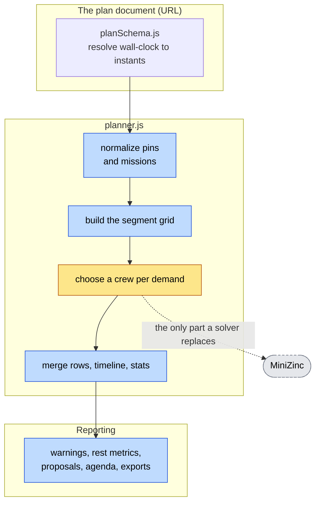

# ADR 008: Keep the hand-written engine; do not ship a general-purpose solver

- Status: Rejected (MiniZinc in the browser). Evaluation only, no engine change.
- Date: 2026-09-15

## Context

The engine in `src/lib/planner.js` is a hand-written greedy walk: it places
pins, then remote and daily holds, then local slots chronologically, choosing
crews one `(mission, segment)` demand at a time and never reconsidering. It is
a heuristic, and heuristics can be wrong in two distinct ways - by returning a
worse schedule than one that exists, and by reporting a shortage that is an
artifact of the walk rather than a fact about the roster.

[MiniZinc's JavaScript API](https://docs.minizinc.dev/en/stable/javascript.html)
offers the obvious alternative: state the rota as constraints and an objective,
and let a constraint solver return an answer that is optimal by construction.
This record evaluates that trade with measurements rather than intuition.

## Decision

**Do not ship MiniZinc, or any general-purpose solver, into the browser
bundle.** Three findings decide it, in descending order of weight.

### 1. It cannot honour the determinism the shared link depends on

This is structural, not a tuning problem, and it alone is disqualifying.

The plan lives in the URL. CLAUDE.md requires that identical absolute engine
inputs produce identical results, and `tests/planner.golden.test.js` pins four
captured schedules byte for byte precisely so a redeployed app never
reschedules a link somebody already sent. A solver does not promise this. It
returns *an* optimal solution, and which one it picks among equally-optimal
ties follows from search order, which moves with the solver version and build -
the npm package is at 4.5.2 with 4.5.3-edge already published. Worse, a phone
needs a time limit so a hard instance cannot hang it, and a time limit makes
the answer depend on how fast the device is. The same link would render one
schedule on a laptop and another on the phone in the guard's pocket.

A total-order objective can make the optimum unique, and removing the time
limit removes the device dependence. Doing both leaves a solver that may run
unboundedly long on a phone to reproduce what the current engine does in 47 ms.

### 2. The payload is twenty-one times the application

| Artifact | Size |
|---|---|
| `minizinc.wasm` | 18.4 MB |
| `minizinc.data` | 513 KB |
| `minizinc-worker.js` | 161 KB |
| **Whole app today, precached** | **875 KiB** |
| Main bundle today, gzipped | 274 KB |

The app is an offline-first PWA that precaches everything it needs. Adding
MiniZinc means a first load that is mostly solver, on phones, for a Hebrew
rota. The three files must also be served and reachable at runtime, which the
"no network at runtime" rule tolerates only because they would be precached
too - paid for in cache budget instead of requests.

### 3. It addresses two of the thirteen defects this project actually had

Read back over the history, the defects cluster somewhere a solver does not
reach. A solver decides *who works when*. Almost everything that went wrong
here was about what a schedule means, what shape it is reported in, or how it
is displayed.

| Defect | Would a solver have prevented it? |
|---|---|
| Three guards on post 88 unbroken hours (#27) | **Yes** - a ranking heuristic made the least-rested guard the cheapest candidate |
| Scarcity ordering stranding a required seat (ADR 005) | **Yes** - and it is still not fully fixed; see below |
| A whole-mission pin emitted as one 163-hour row (ADR 001) | No - "the engine's decision was right all along; only the shape it reports them in has changed" |
| The agenda's duplicated 22:00 time gutter (#27) | No - rendering |
| Warning avalanche, three separate defects (#21, #24, ADR 005) | No - pin normalization and report aggregation |
| Stepping a date back over noon jumping forward nine hours (#35) | No - a 12-hour picker's hour arithmetic |
| Minimum-gap stat masked by on-call sleep (#31) | No - statistics |
| A frozen pin reshuffled by a later availability edit (#21) | No - pin semantics |
| Calendar export hiding the roster from month view (#24) | No - export |
| Two-column mobile agenda unreadable at high headcount (#21) | No - layout |
| Rest preferences fragmenting shifts (#38) | No - segmentation |

Adopting a solver would have bought two of these and introduced a new failure
class the current design cannot absorb.



Everything in blue is where the defects were. Only the amber box is solver
work, and even there the strategies are deliberately *policy*: `rotation` is
defined as a procedural rule ("guards take turns round a fixed ring"), not as
an objective to maximize. Restating it as an objective would change what it
means, and CLAUDE.md names ranking as the one decision the engine delegates.

## The real defect, and the fix that is not a solver

The greedy walk **is** demonstrably incomplete, and the complaint behind this
evaluation is legitimate. `scripts/completenessSearch.mjs` searches for
instances that can be staffed in full but which the engine reports short. It
finds them:

```
employees: e1[medic] e2[commander] e3[driver,commander] e4[driver,commander,medic]
missions : m1 count=1 requires=commanderx1
         | m2 count=2 requires=driverx1+commanderx1
         | m3 count=1 requires=driverx1
engine   : missing-required-tag
```

Every mission here is staffable: patrol `m3` takes `e3`, `m2` takes `e4` and
`e1`, `m1` takes `e2`. The engine reports a missing qualification anyway,
because it filled `m1` and `m2` before it knew what `m3` would need. The user
sees `חסרים אנשים` - "people are missing" - which is false, and a commander
acting on it goes looking for a guard they already have.

This is exactly the failure ADR 005's planning notes predicted and answered
with scarcity ordering. The measurement says scarcity ordering closed most of
it but not all.

**How much it matters depends sharply on the roster.** Across ~85,000 random
feasible instances the false-shortage rate peaks at **0.94%**, on five-person
rosters with exclusions, and falls toward zero as the roster grows. On the
rota shape this app is actually used for - patrol requiring a driver, a gate,
a kitchen refusing commanders, four days, hourly, rotation - it does not fire
at all, at any headcount from critically tight to comfortable:

```
  guards   shifts   reported short   of those, false   hours spread
      10      832                0                 0         1.0h
      17      832                0                 0         1.0h
```

A one-hour spread across four days is, for practical purposes, optimal. There
is no quality gap here for a solver to close.

The residual gap is worth closing anyway, and does not need 18 MB to close.
Within one segment, staffing is a bipartite assignment problem over at most a
few dozen people and a handful of missions. Solving it exactly is cheap,
deterministic, and the machinery is already in the repository: `separateRoles`
in `src/lib/crew.js` is an augmenting-path matcher, applied today *within* one
mission. The fix is to lift `choose` from per-mission to per-segment, so
concurrent missions are settled together rather than in `missionById` order.
That is a change inside `planner.js` phase 3, with no new dependency, no new
bytes shipped, and no threat to the golden fixtures beyond the assignments it
is meant to correct.

## Consequences

The engine stays hand-written, pure, synchronous, and byte-reproducible, and
the bundle stays under 1 MB. The false-shortage gap stays open until the
per-segment fix lands; it is rare, absent from realistic rotas, and now
measurable on demand rather than a matter of opinion.

Choosing not to adopt a solver means schedule quality continues to rest on
review and on `tests/planner.invariants.test.js`, which checks that output is
*legal* across ~1900 generated plans but never that it is *good*. That is the
honest cost of this decision.

## Alternatives rejected

- **MiniZinc compiled into the bundle.** The three findings above.
- **MiniZinc behind a "better schedule" button, off by default.** Halves
  nothing: the payload still ships, and a schedule that cannot be reproduced
  from its own link is worse than one that can, whoever asked for it.
- **Restating `rotation` as an objective function.** Changes what the setting
  means. It is a procedural rule about turns, not a quantity to optimize, and
  CLAUDE.md is explicit that a large `spreadMinutes` under `rotation` is the
  expected outcome rather than a defect.
- **A solver on a server.** There is no backend, ever.

## Alternative worth taking up separately

**MiniZinc as a test oracle, never as a runtime dependency.** Model the
segment assignment problem in MiniZinc, run it in CI over generated instances,
and assert that the shipped engine finds a full staffing whenever one exists.
This is the assurance a solver genuinely offers, at zero shipped bytes: a
`devDependency` and nothing in `dist/`. It would turn "we believe scarcity
ordering is enough" into a standing proof, and it is how the gap above would
have been caught when ADR 005 shipped.

One practical note for whoever picks this up: the npm package's Node path
spawns a native `minizinc` binary rather than using the WebAssembly build -
verified here, it exits `ENOENT` without one - so CI would need the MiniZinc
bundle installed. `scripts/completenessSearch.mjs` is the same idea with brute
force standing in for the solver, which is why it is capped at ten employees.

## Evidence

Measurement: `scripts/completenessSearch.mjs` (`node scripts/completenessSearch.mjs`),
which prints both regimes and a worked counterexample. Bundle figures from
`npm run build` on this tree and from the `minizinc@4.5.2` tarball. Engine
timing from a 17-guard, 3-post, 4-day rota. Defect history from the commit log,
principally #21, #24, #27, #31, #35 and #38, and ADRs 001 and 005.
