# Scheduling plans: pinned person, per-mission shift length, daily missions

Five pieces of work came out of one real rota (a week of 16 guards across four local missions,
`rotation` strategy, hourly shifts). This folder holds a plan for each. Each document carries its
own **Status** line — they exist so a later session (agent or human) can build each piece without
re-deriving the context, and so they do not step on each other in the URL format.

**Progress: 01 and 02 are implemented and merged. 03, 04 and 05 are still plans.** A plan is
updated in place when it lands, so a document's Status line and its "decisions left open" section
are the record of what was actually built.

| # | Document | Kind | Summary |
|---|----------|------|---------|
| 1 | [01-whole-mission-pin-on-local-mission.md](01-whole-mission-pin-on-local-mission.md) | bug | A person pinned to a whole *local* mission comes out of the engine as one 163-hour row, so the agenda shows a slot with one person on a mission that needs five. |
| 2 | [02-per-mission-shift-length.md](02-per-mission-shift-length.md) | feature | חמ"ל needs two-hour shifts by day and one-hour shifts at night. Shift length becomes a per-mission field with a night variant. |
| 3 | [03-daily-missions-and-per-job-rotation.md](03-daily-missions-and-per-job-rotation.md) | feature | תורנות מטבח happens once a day, is held whole by the same people, and rotates per job so nobody cooks twice in a week. |
| 4 | [04-schedule-constraints.md](04-schedule-constraints.md) | hardening | The engine checks its own output: an impossible schedule (double-booking, a row longer than a shift) throws with a descriptive message, and poor-but-legal ones warn. Catches both bugs that have shipped. |
| 5 | [05-qualifications-and-tags.md](05-qualifications-and-tags.md) | feature | Tag people with qualifications (driver, commander), require a qualified person on every shift of a mission, bar a qualification from a mission, and reserve nightly rest for tags that need it. |

## The rota that motivated this

Decoded from the shared link (names omitted): 16 employees, period Thu 16:00 → next Thu 11:00,
`shiftMinutes: 60`, `strategy: rotation`, night 22:00–06:00, and:

| Mission | Type | Count | Notes |
|---------|------|-------|-------|
| ש"ג | local | 1 | |
| תורנות מטבח | local | 2 | modelled as a 24/7 hourly rotation, which is not what it is |
| כרמל מוצב | local | 5 | one person pinned for the whole mission ("4+1") |
| חמ"ל | local | 1 | wants 2 h shifts by day, 1 h at night |

Running today's engine on it: 8 seats every hour for 163 hours, 15 rotating people, so everyone
works 87 hours with a minimum gap of zero, and each person gets 21–22 kitchen shifts. After all
three plans the same rota is 6 rotating seats an hour plus one kitchen occurrence a day, which is
roughly 71 hours a person, one kitchen turn each, and a schedule that reads the way the unit runs —
with the engine refusing, from 04 onward, to emit a shift nobody could work.

## How the three fit together

```mermaid
flowchart LR
  P1["01 · split whole-mission pins<br/>on local missions per slot"]
  P4["04 · engine checks<br/>its own output"]
  P2["02 · per-mission shift length<br/>(day / night)"]
  P3["03 · daily missions +<br/>per-job rotation"]
  P1 -->|"the 163 h row is a<br/>violation, so 04 cannot<br/>land before the fix"| P4
  P4 -->|"ROW_EXCEEDS_SLOT guards<br/>the grid rewrite"| P2
  P2 -->|"missionTurns / slotStart<br/>reused for the per-job key"| P3
  P3 -->|"excludes on the daily kitchen<br/>mission is the stated case"| P5
  P5["05 · qualifications,<br/>tagged seats, rest"]
```

Recommended order: **01 → 04 → 02 → 03 → 05**, one PR each.

- 01 first, because it is a user-visible bug and because 02's turn-counting change assumes a
  local pin already arrives as per-slot rows (see 02, "Turn counting").
- 04 next, and this ordering is hard rather than preferred: its `ROW_EXCEEDS_SLOT` check fails on
  the motivating rota as it stands today, so landing 04 before 01 would throw on a real shared
  link. Once 01 is in, 04 locks the fix in and watches 02 and 03 while they are built.
- 02 before 03 so the per-mission turn bookkeeping is introduced once. 03 *can* be built without
  02 by keeping its own counter in `occupy`; the note in 03 says how.
- 02 and 03 each extend 04's Tier 1 by one line: 02 makes the slot bound per-mission, 03 adds
  `daily` to the exemption list beside remote.
- 05 last: it is the largest change and touches the most. It needs 03, because "commanders never do
  kitchen duty" is an exclusion on the daily kitchen mission. It also adds two Tier-1 invariants to
  04 and one deliberate non-invariant — a missing commander is a roster shortage, not an engine bug,
  and must not throw.

## Wire-format reservation (read before touching `urlState.js`)

The mission tuple is positional and **field order is the wire format** (CLAUDE.md, "Changing the
plan document"). Both features append to the mission tuple, so the positions are fixed here to
stop the second PR from colliding with the first, whichever lands first:

| Position | Field | Introduced by | Encoding of "not set" |
|----------|-------|---------------|-----------------------|
| 0–6 | `id, name, type, start, end, count, nightCount` | existing | `0` for timestamps and `nightCount` |
| 7 | `shiftMinutes` | plan 02 | `0` |
| 8 | `nightShiftMinutes` | plan 02 | `0` |
| 9 | `dayStart` (minutes past midnight) | plan 03 | `null` — `0` is midnight, a real value |
| 10 | `dayEnd` (minutes past midnight) | plan 03 | `null` |

Type code `2` = `daily` (plan 03). `CODE_TYPE[2]` in an older build is `undefined`, which the
decoder already maps to `local` — an old build opening a new link sees a 24/7 local mission
rather than an error, which is the same graceful degradation every appended field gets.

Trailing unset positions should be **trimmed** when encoding (a small `trimTail` helper next to
`outTs`), so a mission that uses none of the new fields encodes exactly as it does today and
old links round-trip byte-for-byte. The decoder reads a missing position as unset. If plan 03
lands before plan 02, it writes `0, 0` in positions 7–8 for daily missions (trimmed away when 9–10
are also unset, i.e. never for a real daily mission) — the positions are reserved, not
negotiable.

No `SCHEMA_VERSION` bump for any of the three: every new field has a schema default that
reproduces the old meaning, exactly as `strategy`, `nightStart` and `nightCount` did.

## Ground rules that apply to all three

- The engine stays pure and timezone-free. Anything wall-clock (`dayStart`, night boundaries)
  is resolved to absolute instants in `planSchema.js`, never inside `planner.js`.
- Existing links must render identically. Each plan names the golden test that pins this.
- `tests/planner.invariants.test.js` is extended with the new fields in its generator; its
  assertions are never weakened.
- New copy goes in `src/strings.js`. New MUI inputs use `slotProps={{ htmlInput: … }}` so the
  `data-testid`s reach `tests/e2e.mjs`.
- Before delivering each PR: `npm run lint && npm test && npm run build`, plus `tests/e2e.mjs`
  (all three touch the schedule screen) and `tests/mobile-viewports.mjs` (02 and 03 change the
  Missions page layout).
