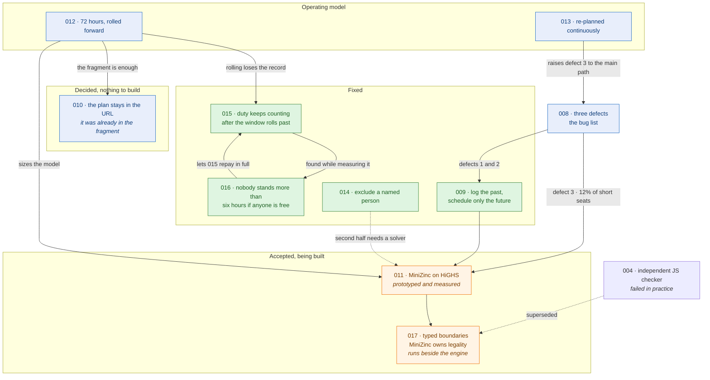

# Architecture decision records

These ADRs describe the implemented scheduling design, plus the alternatives
considered and turned down. The historical `docs/plans` directory and filenames
remain stable for existing references; these documents are decision records, not
pending implementation plans.

| ADR                                              | Decision                                                                   |
|--------------------------------------------------|----------------------------------------------------------------------------|
| [001](01-whole-mission-pin-on-local-mission.md)  | Represent local pins within rotation slots.                                |
| [002](02-per-mission-shift-length.md)            | Give each local mission an explicit rotation grid.                         |
| [003](03-daily-missions-and-per-job-rotation.md) | Hold daily missions by calendar occurrence.                                |
| [004](04-schedule-constraints.md)                | Independent JS schedule checker. *(Failed; superseded by 017)*             |
| [005](05-qualifications-and-tags.md)             | Select qualified crews with preferred night rest.                          |
| [006](06-approved-continuation.md)               | Extend shared plan URLs without reordering existing fields.                |
| [007](07-on-call-missions.md)                    | Count on-call missions toward night rest.                                  |
| [008](08-history-and-staffing-bugs.md)           | Three defects to fix regardless of any refactor. *(Proposed)*              |
| [009](09-timeline-split.md)                      | Log the past, schedule only the future. *(Partly implemented)*             |
| [010](10-plan-storage.md)                        | The plan stays in the URL, where it already is. *(Accepted)*               |
| [011](11-solver-selection.md)                    | MiniZinc as the one engine, on HiGHS. *(Accepted, provisionally)*          |
| [012](12-planning-horizon.md)                    | Plan 72 hours at a time, rolled forward. *(Proposed)*                      |
| [013](13-replanning-under-churn.md)              | Continuous re-planning is the operating model. *(Proposed)*                |
| [014](14-exclusions-and-flexibility.md)          | Exclude individuals; keep scarce people free. *(First half implemented)*   |
| [015](15-fairness-across-rolls.md)               | Duty does not stop counting when the window rolls past it. *(Implemented)* |
| [016](16-unbroken-runs.md)                       | Nobody stands more than six hours if anyone else is free. *(Implemented)*  |
| [017](17-illegal-states-and-solver-boundaries.md)| Typed boundaries; MiniZinc owns optimization and legality. *(Steps 1, 3-5 built)* |

## How these fit together

Each record states the context, decision, consequences, rejected alternatives,
and implementation or test evidence. Acceptance dates record this design, not a
claim about deployment. Superseding decisions should identify the affected ADR.
ADRs 001-003 and 005-007 are implemented; 004 failed and is superseded by 017.
**011 is accepted provisionally, 017 is accepted, and 012's
retention question is decided; the rest are proposed**, and are split so each can
be taken or left on its own:

- **008** is the bug list, and stands alone. A headcount edit rewrote history
  (**fixed**), history outside the period was silently deleted (**fixed**) and
  is now shown read-only beside the button that exports it (**fixed**), and the
  staffing pass reports shortages that are not real (partly fixed by #40, and
  its size corrected: 88% of what it reports short is genuinely short).
- **009** fixes the first two by never re-deciding elapsed time. Its core rule
  is **implemented**: the clock enters at the adapter as an absolute instant,
  an elapsed segment carrying a record defers to it, and the headcount cap stops
  applying there. The log as its own structure, and 012's export, remain.
- **010** is where the growing log is kept. An earlier revision claimed the plan
  was a query parameter and had to move to the fragment; it was already there,
  because the app uses `HashRouter`. **Nothing to build.** The correction is in
  the record, along with what the real ceiling is and why local-first stays
  dormant.
- **011** is the solver question that started all of this. **MiniZinc**,
  accepted "for now", on ownership and failure surface rather than solving
  technology. The prototype now exists in `prototype/minizinc/` and has already
  corrected the record twice. It agrees with a brute-force oracle over 420
  random instances, and it **corrected the evidence this whole branch rested
  on**: measured over a whole horizon rather than one instant at a time, 88% of
  the seats the engine reports short are genuinely short and about 12% are the
  greedy walk losing - not the "2.8% provably false" that `offGridFuzz.mjs`'s
  per-instant oracle suggested. It also showed that **Chuffed, which this ADR
  named explicitly, is the wrong backend**: it stops proving optimality past a four-hour horizon, where HiGHS
  in the same WebAssembly bundle proves a perfectly balanced 72-hour schedule in
  under eight seconds.
- **012** records the 72-hour horizon and what it does to the others: it settles
  010 (the fragment is enough, local-first is not needed), sizes 011 at 648
  assignments, and raises 008's second defect to the main path because rolling
  the window forward is the normal operation. Its retention question is
  **decided: a rolled-past window is exported**, which bounds the log to one
  window and makes the export the only durable record - raising the bar on it,
  since a roll that completes without a successful export is data loss.
- **013** records that the rota is re-solved continuously against a moving
  present, not planned once. That re-rated 008's third defect from rare to the
  main path, which #40 then addressed for the reported shape.
- **015** is the one the prototype work turned up by accident. The rota is
  planned 72 hours at a time and rolled forward, and the engine evens out the
  window it is given - so an hour stopped counting the moment it fell behind the
  window. A guard away for two days came back permanently 36 hours behind, and
  the app reported a spread of **0.0h** at every roll while it happened.
  **Implemented:** duty outside the period counts, from the pins themselves and
  from a per-person carried total that survives ADR 012's export. It is
  normalized against the least-worked person and clamped to two shift slots,
  and both of those were bought with measurements: in absolute hours a newcomer
  stood 72 of a 72-hour window unbroken, and unclamped, repaying a 36-hour gap
  bought 72 unbroken hours. With 016 capping the run directly the debt can be
  repaid in full - six rolls, nothing left over, and nobody standing more than
  six hours doing it.
- **014** adds per-person exclusions - **implemented**, at wire position 14,
  with one shared `isExcluded` predicate replacing five copies of the tag check
  - and the softer rule that scarce qualifications should be kept uncommitted so
  they can answer a callout. That second half is an objective term, and waits
  for ADR 011.

- **016** is the one to read first. Evening out hours is *what produces* an
  unbroken run, so where somebody joined a period part-way through - leave, a
  course, a new arrival - **half of those plans put a guard on post for
  twenty-four hours or more without a break**, up to a full seventy-two, with
  nobody carrying anything. **Implemented:** a tier above the minutes key, six
  hours, at which no golden fixture changes and no test fails. What survives it
  is a staffing shortage rather than a scheduling one - 100% of the remaining
  cases have nobody spare at all.

- **017** explicitly supersedes 004, whose independent JavaScript checker
  failed in practice as a second legality authority. Permissive URL/editor
  drafts are parsed once into a strict typed problem; MiniZinc owns both
  optimization and fixed-candidate checking through one shared constraint
  core; and one mission value per employee/segment makes double booking
  unrepresentable. The old checker stays only as migration instrumentation
  until the hand-written scheduler is removed.

Suggested order, updated now that 009's core rule has landed:

1. ~~012's export plus 008's defect 2~~ - **closed, both halves.** Nothing
   removes recorded duty automatically, the out-of-period button exports before
   it clears, and what it would carry away is now shown read-only beside it.
2. ~~010's fragment move~~ (not needed - already in the fragment) and
   ~~014's first half~~ (**done** - per-person exclusions).
3. **011** - the MiniZinc model, which closes the shortage class #40 narrowed
   but did not eliminate. **The model itself is prototyped and measured**
   (`prototype/minizinc/`): oracle-checked, and it finds the crews the engine
   misses. Its `invariants.js` prerequisite is **partly done**:
   `UNREPORTED_SHORTFALL` and `PIN_DROPPED` now catch a schedule that is short
   without saying so, or that quietly loses an accepted pin. Rest-score
   correctness, fairness optimality and false UNSAT still need an oracle rather
   than an invariant.
4. ~~011's adapter~~ - **done** (`prototype/minizinc/fromPlan.mjs`), which is
   what made the horizon measurement possible. It imports `segmentGrid`,
   `acceptedPins` and `countAt` from the engine rather than re-deriving any of
   them.
5. ~~011's browser path~~ - **measured**. The model solves a 72-hour horizon to
   proven optimality in a real Chromium in 13.7s, off the main thread, served
   **without COOP/COEP** - so GitHub Pages can host it, which was this ADR's
   one hosting risk. HiGHS is genuinely in the WebAssembly build. Assets are
   5.2MB gzipped.
   Offline works too: cache the assets, cut the network, stop the server,
   reload, and the ladder still proves every level.
6. **What 011 still needs** is a real phone. Peak memory is now measured and it
   is the finding to weigh: 250-400MB resident, flat across horizons, almost
   all of it MiniZinc rather than Chromium. A background tab that size is one
   Android may reclaim. CDP CPU throttling cannot give the speed figure because
   it reaches the main thread and not the worker. The model's remaining levels -
   history, rest, rotation turn counting - are the other half, and are modelling
   work rather than measurement.

## Verification

Run `npm run lint`, `npm test`, and `npm run build`. ADR 008's defects are
reproduced with `node scripts/historyDriftCheck.mjs` (defects 1 and 2) and
`node scripts/rollForwardLoss.mjs` (defect 2 under ADR 012's export decision),
and `node scripts/completenessSearch.mjs` with `node scripts/offGridFuzz.mjs`
(defect 3, before and after #40); all are measurements rather than tests and are
deliberately outside `npm test`. ADR 011's model is measured by
`node prototype/minizinc/check.mjs` and `node prototype/minizinc/vsEngine.mjs`,
which need a `minizinc` binary on `PATH` and are outside `npm test` for that
reason. Browser acceptance uses
`tests/e2e.mjs`, `tests/mobile-viewports.mjs`, `tests/features.e2e.mjs` and
`tests/carried-duty.e2e.mjs` against a local built preview. Set `CHROME` to a headless Chromium binary and
`SHOT_DIR` outside the repository.
